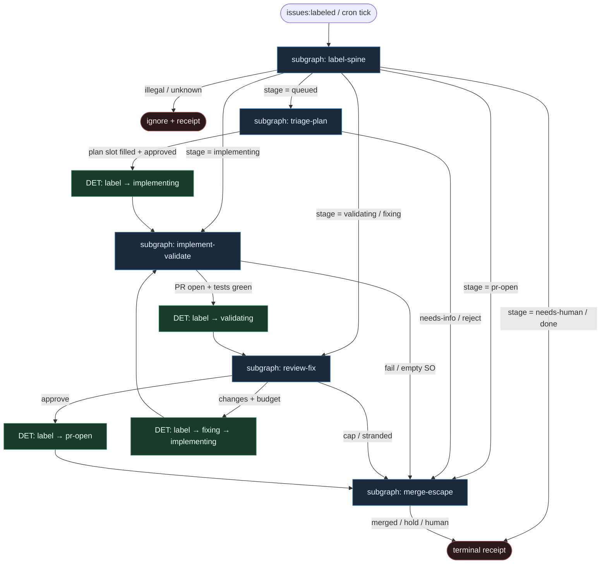

# 09 — Label FSM (GitHub stages)

**Persona:** label-fsm-compose — etapy = etykiety; **GHA / skrypty** przesuwają stan; **agenci tylko wypełniają sloty** (SO). Kompozycja w stylu gp-foundry + chippingway + jnurre (sandbox-pal).

**Approach:** compose_label_fsm. Stan maszyny żyje w labels na issue/PR. Zero lokalnego daemona jako źródła prawdy; executor = GitHub Actions (albo cienki skrypt, który tylko odbija te same przejścia).

## Design notes

- **Label = stan.** `workflow:queued` → `…:planning` → `…:implementing` → `…:validating` → `…:fixing` → `…:pr-open` → `…:done` / `…:needs-human`. Jedna aktywna etykieta stage naraz (mutex DET).
- **GHA/scripts advance.** Przejścia robią workflowy (`issues: labeled`, `pull_request`, cron supervisor) albo lokalny skrypt z tą samą tabelą przejść. Agent **nie** woła `gh label` sam z siebie.
- **Agents fill slots only.** Scout/plan/implement/review to liście SO: komentarz planu, diff, werdykt review. Po `ok:true` skrypt dokleja następną etykietę; po `ok:false` — escape albo bounded fix.
- **gp-foundry:** topologia → skompilowane joby; stan w labels/PR/cron; merge_gate = policy YAML, nie persona.
- **chippingway:** `workflow:*` jako FSM na issue; worktree; HITL na merge.
- **jnurre/sandbox-pal:** label-driven dispatch (`agent`, `agent:plan-approved`, …); plan HITL; adversarial review; revision loop; circuit breaker.
- **DET majority.** Lista / claim / flip label / worktree / test / push / open PR / CI wait / merge policy — DET. Entropia tylko w slotach AGENT.
- **Coder ≠ merge.** Sufit implementera = PR + etykieta `workflow:pr-open`. Merge = Off|Classify|Always albo człowiek.
- **Bounded loops.** Fixer / revision ma cap (np. 3); supervisor cron po 2 nudge → `workflow:needs-human`. Escape edge obowiązkowy (jak model-check w gp-foundry).
- **Meat ≡ AI.** To samo siedzenie w slocie; graf się nie zmienia.
- **NOT L5.** Zdejmujemy klepanie issue→PR→review ping. Nie lights-out bank.

## Top-level flowchart

**DET vs AGENT at a glance**

| Warstwa | Mode | Kto | Uwaga |
|---------|------|-----|-------|
| Trigger labeled / cron | DET | GHA | jedyny start FSM |
| Flip stage label | DET | GHA/script | agent nie flipuje |
| Scout / plan comment | AGENT SO slot | liść | po ok → DET advance |
| Plan approve | DET / HITL label | człowiek lub policy | `plan-approved` |
| Implement + local test | AGENT SO + DET gate | liść + atom | worktree K=1 |
| Open PR / CI wait | DET | script | `Closes #N` |
| Review / fixer | AGENT SO + DET cap | liść + counter | max N |
| Merge Off\|Classify\|Always | DET policy | merge_gate | nigdy LLM-merge |
| needs-human escape | DET | supervisor | obowiązkowy exit |

## Index of subgraphs

| File | Theme | Role in chain |
|------|--------|----------------|
| [subgraph-label-spine.md](./subgraph-label-spine.md) | tabela przejść + mutex etykiet | DET kręgosłup FSM |
| [subgraph-triage-plan.md](./subgraph-triage-plan.md) | scout + plan slot | AGENT wypełnia; HITL approve |
| [subgraph-implement-validate.md](./subgraph-implement-validate.md) | implement slot → test → PR | AGENT kod; DET git/CI |
| [subgraph-review-fix.md](./subgraph-review-fix.md) | review + bounded fix labels | AGENT werdykt; DET cap |
| [subgraph-merge-escape.md](./subgraph-merge-escape.md) | merge policy + needs-human | DET escape / Off\|Classify\|Always |

## Label vocabulary (compose)

| Label | Znaczenie | Kto może ustawić |
|-------|-----------|------------------|
| `workflow:queued` | start / re-drive | człowiek, scout DET, supervisor |
| `workflow:planning` | plan slot aktywny | GHA po queued |
| `workflow:plan-approved` | HITL/policy OK | człowiek lub DET policy |
| `workflow:implementing` | implement slot | GHA |
| `workflow:validating` | review slot | GHA po PR |
| `workflow:fixing` | bounded repair | GHA po changes-requested |
| `workflow:pr-open` | czeka na merge policy | GHA po approve |
| `workflow:needs-human` | escape | GHA/supervisor |
| `workflow:done` | terminal | GHA po merge |

Alias jnurre-style (`agent`, `agent:implement`, `agent:plan-approved`, …) mapuje 1:1 w MANIFEST `label_aliases`.

## Antyteza (czego tu nie ma)

- Agent wybierający next issue z czatu / unlabeled backlogu
- Agent sam flipujący etykiety „bo tak wyszło z promptu”
- Fat orchestrator tool-callingiem zamiast GHA tabeli przejść
- Unbounded fixer / revision bez escape do `needs-human`
- Merge w liściu implementera
- L5 lights-out / wymyślanie ticketów
