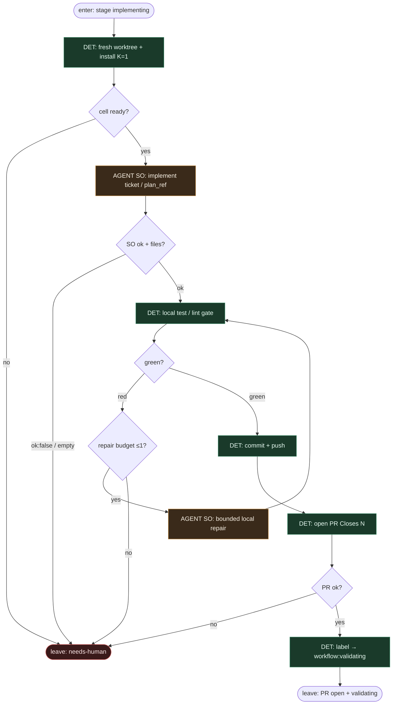

# Subgraph: implement-validate

**Theme:** implement slot w fresh worktree → lokalny test DET → push/PR → etykieta validating.  
**Mode mix:** AGENT SO implement (+ opc. 1× local repair); reszta DET.

## Flow

## Notes

- **Fresh worktree.** chippingway / ready-for-agent: jeden ticket → jedna komórka; brak współdzielonego dirty tree.
- **Agent fills code slot only.** Structured `{ok, summary, files[]}`. Nie otwiera PR, nie ustawia labeli, nie merguje.
- **Lokalny test = bramka DET.** Czerwony po max 1 repair → escape. Nie PR na czerwono.
- **Open PR = DET.** Template + `Closes #N`; po sukcesie **skrypt** ustawia `workflow:validating` (jnurre `agent:pr-open` alias mapuje tu albo na `pr-open` po approve — w tej kompozycji validating najpierw).
- **Re-entry from fixing.** Ten sam podgraf; counter fix żyje w labels/comment metadata, nie w „pamięci agenta”.
- **Handoff:** `{pr_url, branch, head_sha}` → review-fix.
