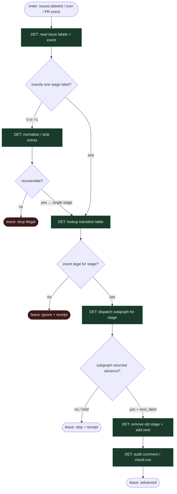

# Subgraph: label-spine

**Theme:** etykiety = stany FSM; tylko GHA/skrypt wolno flipować; mutex jednej stage-label.  
**Mode mix:** 100% DET. Zero AGENT w kręgosłupie.

## Flow

## Transition table (compose)

| From | Event / predicate | To | Who flips |
|------|-------------------|----|-----------|
| *(none)* / human | label `workflow:queued` | `queued` | człowiek / scout |
| `queued` | job start | `planning` | GHA |
| `planning` | plan SO ok + approve label | `implementing` | GHA |
| `planning` | needs-info / reject | `needs-human` | GHA |
| `implementing` | SO ok + tests + PR | `validating` | GHA |
| `implementing` | SO fail / empty | `needs-human` | GHA |
| `validating` | review approve | `pr-open` | GHA |
| `validating` | changes + budget>0 | `fixing` | GHA |
| `fixing` | re-enter implement | `implementing` | GHA |
| `validating`/`fixing` | cap / stranded | `needs-human` | GHA/supervisor |
| `pr-open` | merge policy ok | `done` | GHA |
| `pr-open` | Off / high risk | stay + HITL | — |
| `*` | supervisor 2 nudges | `needs-human` | cron |

## Notes

- **gp-foundry spine.** Topologia skompilowana do jobów; ten podgraf = model-check w runtime: nielegalne krawędzie → drop, nie „agent zdecyduje”.
- **chippingway `workflow:*`.** Jedna aktywna etykieta stage — mutex DET przed każdym flipem.
- **jnurre label-driven.** `issues: labeled` jest impulsem; cron supervisor re-drive'uje stranded bez nowego mózgu.
- **Agent never routes.** Nawet gdy SO sugeruje „idź do fix” — skrypt czyta enum `next` z kontraktu i **sam** mapuje na tabelę. Poza tabelą = `needs-human`.
- **Handoff:** `{stage, issue_id, event, next?}` albo `{drop|ignore}`.
