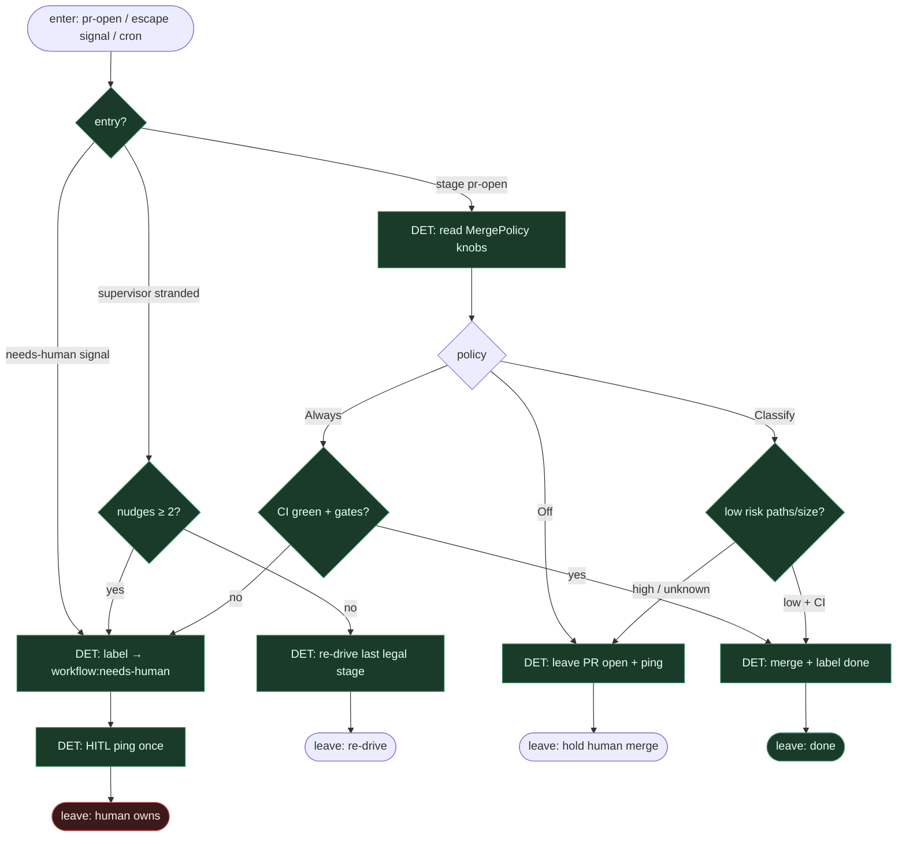

# Subgraph: merge-escape

**Theme:** merge Off|Classify|Always + obowiązkowy escape `needs-human`; supervisor cron.  
**Mode mix:** 100% DET policy. Agent nie merguje.

## Flow

## Notes

- **merge_gate ≠ persona.** gp-foundry: policy YAML (CI, size, paths). Tu to samo — Classify to reguły, nie prompt „czy wygląda OK”.
- **Default Off.** chippingway / jnurre: człowiek merguje; klepacz kończy na gotowym PR + jednym pingu HITL.
- **Escape first-class.** Każda ścieżka fail/cap/strand kończy w `workflow:needs-human`. Brak escape w grafie = nielegalna kompozycja.
- **Supervisor cron.** Re-drive raz/dwa; potem human. Bez nieskończonego „nudge w pętli”.
- **done = terminal.** Po merge: cleanup worktree, zdejmij stage, ustaw `workflow:done` (opc. jnurre post-merge cleanup).
- **Handoff:** `{merged|hold|needs_human, pr_url}`.
