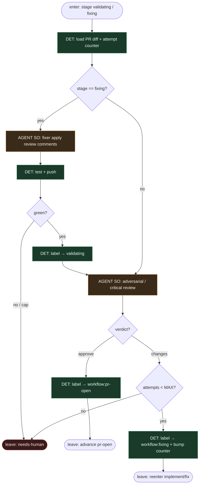

# Subgraph: review-fix

**Theme:** niezależny review slot + bounded fix przez etykiety (nie chat-loop w jednym mózgu).  
**Mode mix:** AGENT SO review/fixer; DET cap, label flips, CI re-check.

## Flow

## Notes

- **Reviewer ≠ implementer.** Osobny job/profil (gp-foundry reviewer; chippingway Codex review; jnurre adversarial). Write limited do komentarzy / werdyktu SO.
- **Werdykt = enum.** `{verdict: approve|changes|block, comments[]}`. DET mapuje na label — model nie „klika merge”.
- **Bounded fix.** MAX (np. 3) w metadata issue/PR. Cap → `workflow:needs-human` / `agent:review-unresolved`. Escape obowiązkowy jak w gp-foundry model-check.
- **Fixing to osobny stage.** Etykieta `workflow:fixing` (jnurre `agent:revision`) wraca do implement-validate albo lokalnego fixer slota — zawsze przez spine, nie przez ukryty goto w prompcie.
- **CI wait.** Opcjonalny DET check-run przed approve; czerwone CI ≠ approve.
- **Handoff:** `{verdict, attempts}` → merge-escape albo re-enter.
