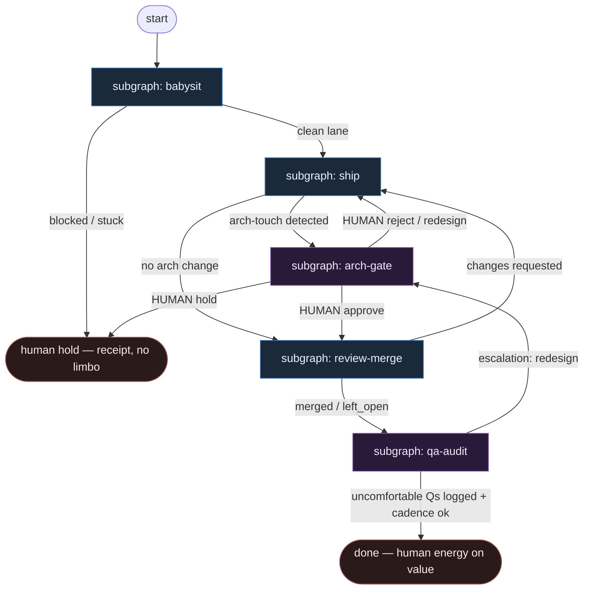

# 10 — Human Amplify

**Persona:** human-amplify — człowiek (inżynier + QA strategist) w centrum; DET zabiera babysitting; jawne bramki HUMAN na zmianę architektury i periodyczny audyt QA.

**Approach:** from_scratch. Osobny graf + tematyczne podgrafy (nie monolit). Polish OK.

## Design notes

- **Człowiek w centrum, nie na końcu.** Inżynier i QA-strateg są pierwszorzędnymi węzłami — nie „opcjonalnym leftoverem po merge”. Graf wzmacnia ich uwagę, nie zastępuje jej.
- **Babysitting = DET.** Poll CI, dirty worktree, stuck PR, label re-check, flaky re-run — skrypty z boundami. Zero energii człowieka na klepanie pośrednie.
- **Jawna bramka architektury.** Każda zmiana, która rusza kontrakty / granice modułów / topologię systemu → `subgraph-arch-gate` (HUMAN). Agent nie „przemyca” architektury w implementacji.
- **Periodyczny QA audit.** Osobny podgraf `qa-audit`: niewygodne pytania („czemu tak — nie da się prościej?”, regresje ukryte, over-engineering). Cadence, nie one-shot po PR.
- **AGENT tylko tam, gdzie entropia się płaci.** Implement (jak zakodować) + critical review (osobna rola, structured verdict). Meat ≡ AI w tych samych siedzeniach.
- **Merge policy jest DET.** Off / Classify / Always — nigdy LLM-merge. High-risk + Always = zabronione.
- **No limbo labels.** Skip, fail, hold, left_open — jawne stany z receipt. Nie `needs-human-maybe`.
- **NOT L5.** Cel odwrotny do lights-out: zdjąć wyczerpanie, zostawić wartość (architektura + niewygodne pytania). Dobry QA nie znika — zyskuje czas.
- **One ticket, one PR.** K=1; zmiany architektury wymagają osobnego arch-gate przed shipem lub przed merge.

## Top-level flowchart

**DET vs AGENT vs HUMAN at a glance**

| Layer | Mode | Responsibility |
|-------|------|----------------|
| Babysit | DET | dirty tree, labels, stuck PR, CI poll/retry — automate exhausting middle |
| Ship (implement) | AGENT SO | coding judgment only |
| Ship (git/PR) | DET | branch, test, commit, push, open PR; flag `arch_touch` |
| Architecture gate | **HUMAN** | approve / reject / redesign when contracts or topology change |
| Critical review | AGENT SO | verdict + reasons[] (osobna rola ≠ implementer) |
| Merge policy | DET | Off / Classify / Always — never LLM merge |
| QA audit | **HUMAN** | periodic uncomfortable questions; cadence receipt |

## Index of subgraphs

| File | Theme | Role in chain |
|------|--------|----------------|
| [subgraph-babysit.md](./subgraph-babysit.md) | DET babysitting | front door — zdjąć klepanie |
| [subgraph-ship.md](./subgraph-ship.md) | implement → PR + arch_touch flag | AGENT code + DET git |
| [subgraph-arch-gate.md](./subgraph-arch-gate.md) | **HUMAN** architecture change | explicit gate — no sneak |
| [subgraph-review-merge.md](./subgraph-review-merge.md) | review → merge policy | AGENT review + DET policy |
| [subgraph-qa-audit.md](./subgraph-qa-audit.md) | **HUMAN** periodic QA audit | niewygodne pytania na cadence |

## Human-amplify invariants (explicit)

1. Babysitting nigdy nie jest zadaniem człowieka — DET albo escape z receipt.
2. `arch_touch=true` → obowiązkowy `arch-gate` przed merge (fail-closed).
3. QA audit ma własny cadence (np. co N merge / co sprint) — nie „jak starczy czasu”.
4. Reviewer ≠ Implementer; HUMAN ≠ rubber-stamp AGENT.
5. Escape / hold pisze receipt, nie limbo label.
6. Meat ≡ AI w AGENT seats; HUMAN seats zostają ludzkie.

## Kryterium sukcesu (z SOUL)

Człowiek ma energię na architekturę i niewygodne pytania — bo DET odrobił babysitting (poll, retry, dirty, stuck). Technicznie: PR otwarty i albo zmergowany, albo świadomie `left_open` z receipt; dodatkowo zapisany wynik `qa-audit` na cadence — nie ładny JSON bez skutku.
