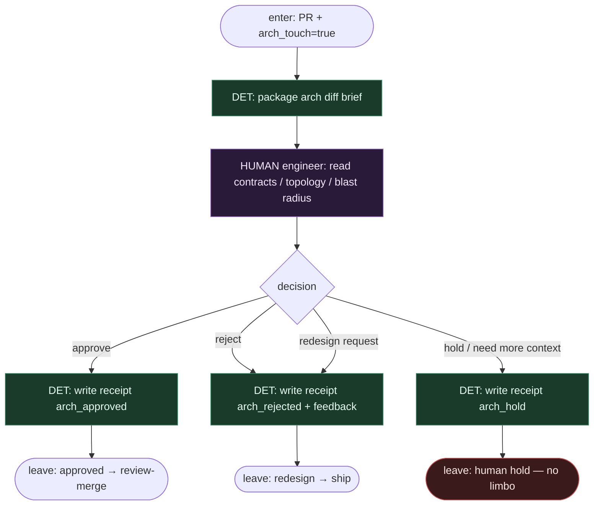

# Subgraph: arch-gate

**Theme:** jawna bramka HUMAN na zmianę architektury — approve / reject / redesign / hold.  
**Mode mix:** 100% HUMAN (+ DET receipt). Agent nie zatwierdza własnej zmiany kontraktu.

## Flow

## Notes

- **To jest rdzeń human-amplify.** Architektura nie jest „komentarzem w review” — jest osobnym siedzeniem HUMAN z binding decision.
- **Fail-closed.** `arch_touch=true` bez `arch_approved` receipt → merge zabroniony (nawet przy MergePolicy Always).
- **Pytania inżyniera (minimum):**
  1. Jaki kontrakt się zmienia i kto go konsumuje?
  2. Czy da się osiągnąć cel bez ruszania granicy modułu?
  3. Jaki jest rollback / compat path?
  4. Czy ADR / docs trzeba zaktualizować w tym samym PR?
- **DET tylko pakuje brief i pisze receipt.** Nie „sugeruje approve”. Nie limbo label — `arch_hold` / `arch_rejected` / `arch_approved` z id.
- **Meat nie siedzi tu jako AGENT.** Gate jest ludzki z definicji; AI może przygotować brief, nie decyzję.
- **Handoff:** `{arch:approved, receipt_id}` | `{arch:rejected, feedback}` | `{arch:hold, receipt_id}`.
