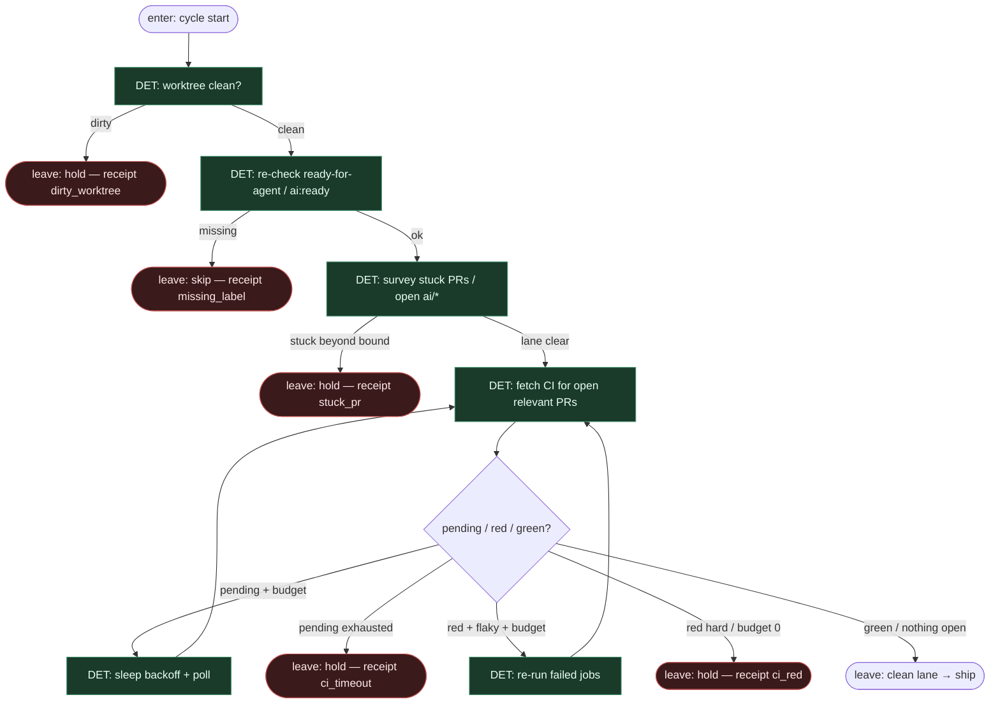

# Subgraph: babysit

**Theme:** DET zabiera wyczerpujące klepanie — dirty tree, labelki, stuck PR, CI poll/retry.  
**Mode mix:** 100% DET. Człowiek nie babysittuje; agent nie „ratuje” infrastruktury.

## Flow

## Notes

- **To jest sens human-amplify.** Energia inżyniera nie idzie w poll/retry/dirty — idzie w arch-gate i QA audit.
- **Bounds are sacred.** `poll_budget`, `rerun_budget`, `max_wall_clock`, `stuck_age`. Wyczerpanie → hold z receipt, nie limbo label.
- **Fail-closed front door.** Brudny worktree / brak labela / stuck PR = nie startujemy nowego shipa.
- **No AGENT here.** LLM nie interpretuje logów CI żeby „uznać za zielone”. CI jest wyrocznią.
- **Hard fail vs flaky.** Compile / typecheck / policy = hard. Allowlist flake = flaky. Nieznane = hard.
- **Handoff:** `{lane:clean}` albo `{hold:true, reason, receipt_id}` / `{skip:true, reason}`.
