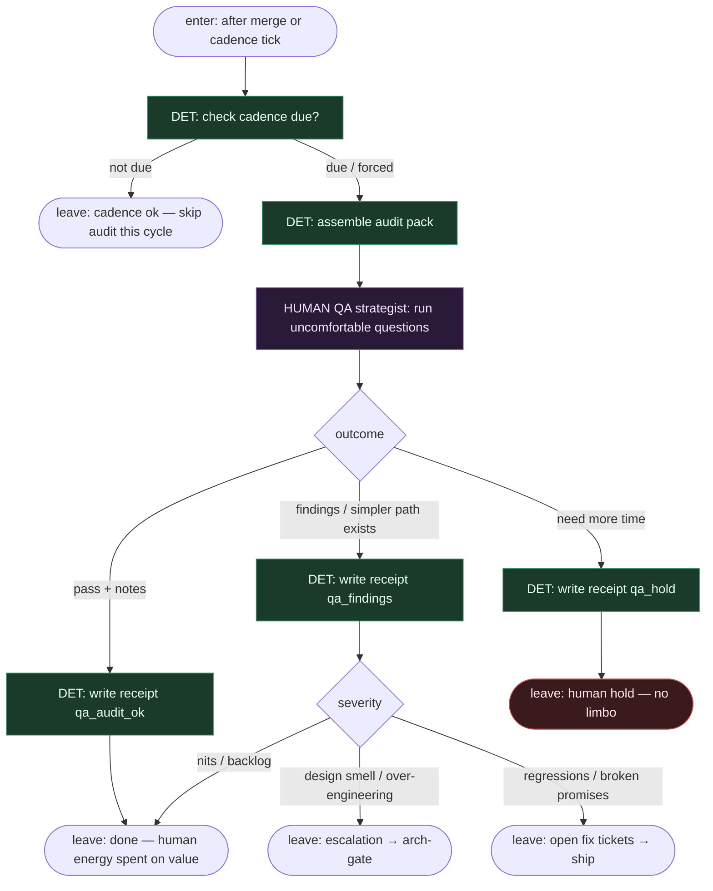

# Subgraph: qa-audit

**Theme:** periodyczny audyt QA-stratega — niewygodne pytania, nie checklista happy-path.  
**Mode mix:** 100% HUMAN (+ DET cadence / receipt). Dobry QA nie znika — zyskuje czas bo babysitting jest DET.

## Flow

## Uncomfortable questions (kanon minimum)

1. **Czemu tak — nie da się prościej?** Jaki jest najtańszy wariant, który nadal spełnia acceptance?
2. **Co tu jest over-engineered?** Abstrakcje bez drugiego konsumenta, przedwczesne frameworki, „elastyczność” bez scenariusza.
3. **Jakie założenie milczy?** Co musi być prawdą, żeby to działało — i kto to zweryfikował?
4. **Gdzie jest regresja ukryta?** Edge case, migracja danych, compat klientów, flaky maskujący bug.
5. **Czy acceptance nadal opisuje rzeczywistość?** Ticket vs tip hosta — rozjazd = finding.
6. **Kto boli przy rollbacku?** Czas, dane, kontrakty zewnętrzne — jeśli „nie da się cofnąć”, to finding.
7. **Czy testy bronią zachowania czy implementacji?** Kruche testy ≠ jakość.
8. **Czy QA-strategia projektu się starzeje?** Coverage theatre, martwe e2e, brak sygnału z produkcji.

## Notes

- **Cadence, nie leftover.** Np. co N merge / co sprint / po każdym `arch_approved`. Overdue blokuje „celebrate done” (fail-closed na celebrację, nie na ship hotfixów — polityka zespołu).
- **Audit pack (DET):** ostatnie merge SHAs, arch receipts, failing/flaky trends, otwarte `left_open`, diff stats, ADR deltas.
- **Niewygodne > checklista.** Happy-path smoke to nie ten podgraf — ten podgraf jest po to, by kwestionować.
- **Escalation paths are real.** Design smell → arch-gate; regresja → fix tickets → ship. Nie „zapiszemy w Notion i zapomnimy”.
- **HUMAN seat stays human.** Agent może zebrać pack; pytania i werdykt strategiczny są ludzkie (SOUL: QA strategia zostaje).
- **Handoff:** `{qa:ok, receipt_id, notes}` | `{qa:findings, items[], severity}` | `{qa:hold, receipt_id}` | `{cadence:skip}`.
