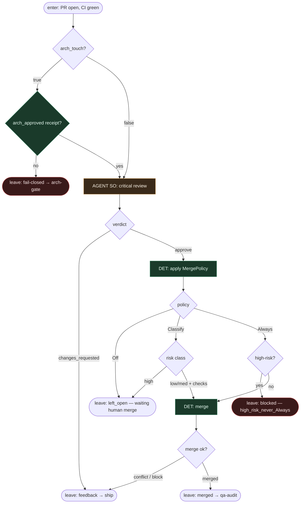

# Subgraph: review-merge

**Theme:** krytyczny review (osobna rola) → DET merge policy; arch receipt wymagany gdy trzeba.  
**Mode mix:** AGENT SO (review) + DET (policy / merge) + hard check na arch-gate.

## Flow

## Notes

- **Reviewer ≠ Implementer.** Osobna rola AGENT SO: spójność, fit architektoniczny (gdy arch już approved), komentarze, structured verdict.
- **Arch receipt jest twardym checkiem.** Bez niego nie ma ścieżki do merge — nawet gdy review jest zielony.
- **MergePolicy Off default.** Never LLM merge. Always + high-risk = zabronione.
- **left_open is honest.** Policy Off → PR zostaje otwarty z receipt; człowiek merżuje gdy chce — nie limbo theatre.
- **Handoff:** `{merged:true, merge_sha}` | `{left_open:true, reason}` | `{changes_requested, feedback}` | `{blocked, reason}`.
