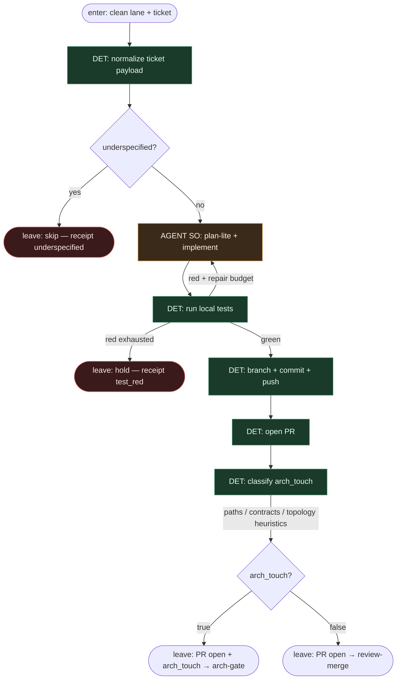

# Subgraph: ship

**Theme:** implementacja → test → branch/commit/push/PR; jawny flag `arch_touch`.  
**Mode mix:** AGENT SO (jak zakodować) + DET (git/PR + detekcja arch_touch).

## Flow

## Notes

- **AGENT = tylko entropia kodu.** Narrow seat: jak zaimplementować ten ticket. Nie orkiestruje tool-callingiem całego procesu.
- **DET owns git/PR.** Branch, commit(s), push origin, open PR — skrypt. Meat ≡ AI w AGENT seat bez zmiany grafu.
- **`arch_touch` is first-class.** Heurystyki DET (zmiana publicznych API, schematów, granic pakietów, ADR-tagged paths, `ARCHITECTURE.md`, topology configs). False negative → człowiek i tak może wymusić gate; false positive → tani HUMAN glance.
- **One ticket, one PR.** K=1; bez mega-branchy. Repair loop bounded.
- **Nie przemycać architektury.** Jeśli implementacja „przy okazji” rusza kontrakt — flag musi być `true`. Arch-gate jest obowiązkowy przed merge.
- **Handoff:** `{pr, arch_touch:bool, sha}` albo `{skip|hold, reason, receipt_id}`.
