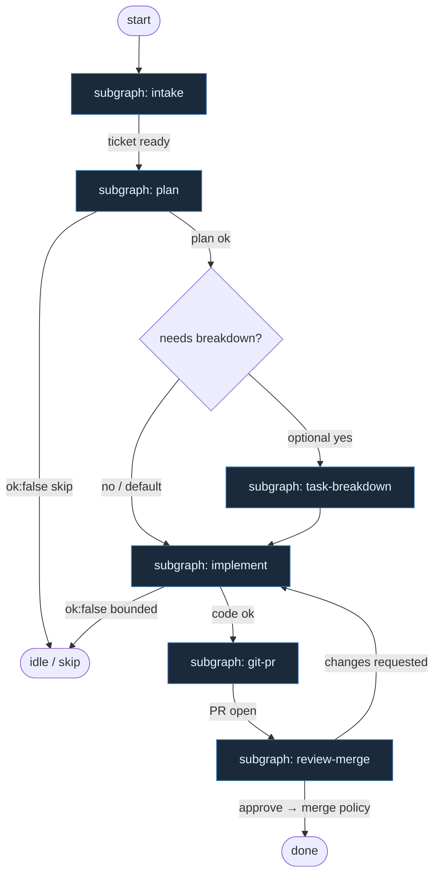

# 11 — Planner / Coder (dual light agents)

**Persona:** dual-light-agents — dwa wąskie liście SO (plan-only + implement); opcjonalny task-breakdown; cały git/PR to DET.

**Approach:** from_scratch. Nie jeden gruby orkiestrator tool-callingiem — dwa lekkie mózgi + skrypty.

## Design notes

- **Dwa lekkie agenty, nie jeden fat brain.** `plan_issue` (tylko plan) i `implement` (tylko kod) to osobne liście ze structured output. Żaden nie routuje grafu.
- **Plan-only SO leaf.** Planista rozpisuje goal / files / test_command / non_goals / stop_if — zero produktowego kodu, zero PR.
- **Implement SO leaf.** Coder dostaje plan jako kontrakt; pisze diff; nie otwiera PR i nie merjuje.
- **Opcjonalny task-breakdown.** Gdy plan mówi `needs_breakdown` albo ticket jest za duży na jeden shot — lekki AGENT SO rozpisuje pliki/taski; default path pomija go.
- **Cały git/PR = DET.** Branch, commit(s), push, open PR, CI wait, merge policy — skrypty/atomy. Agenty nie klepią gita ani nie „dogadują” PR.
- **Meat ≡ AI.** W siedzeniu AGENT może siedzieć człowiek albo model; topologia się nie zmienia.
- **NOT L5.** Cel: zdjąć wyczerpujące klepanie (ticket→branch→push→PR), żeby energia szła w architekturę i niewygodne pytania QA — nie lights-out bank.
- **Jeden ticket, jeden PR.** K=1; brak mega-branchy; changes-requested wraca do implement (bounded).
- **Fail closed na DET i na SO.** `ok:false` / czerwone testy / brak labela → skip lub bounded repair, bez limbo theatre.
- **Review osobna rola.** Coder nie stempelkuje własnego PR; critical review = osobny AGENT SO (lub człowiek).

## Top-level flowchart



**DET vs AGENT at a glance**

| Seat | Mode | Responsibility |
|------|------|----------------|
| Intake | DET | Enter PM, pick labeled job, normalize ticket, occupancy K=1 |
| Plan (light #1) | AGENT SO | Plan-only: goal, files, tests, non_goals, stop_if |
| Task-breakdown (optional) | AGENT SO | Rozpisanie plików/tasków gdy plan/ticket za gruby |
| Implement (light #2) | AGENT SO | Kod według planu; bounded repair_code |
| Git / PR | DET | Branch, commit, push, open PR — zero agent git |
| Critical review | AGENT SO | Osobna rola: approve / changes / reject |
| Merge | DET | MergePolicy Off\|Classify\|Always |

## Index of subgraphs

| File | Theme | Role in chain |
|------|--------|----------------|
| [subgraph-intake.md](./subgraph-intake.md) | PM → labeled job → ticket | DET front door |
| [subgraph-plan.md](./subgraph-plan.md) | Plan-only SO leaf | Light agent #1 |
| [subgraph-task-breakdown.md](./subgraph-task-breakdown.md) | Optional files/tasks split | Light AGENT SO (opcjonalny) |
| [subgraph-implement.md](./subgraph-implement.md) | Implement SO leaf | Light agent #2 |
| [subgraph-git-pr.md](./subgraph-git-pr.md) | Branch → commit → push → PR | **All git/PR DET** |
| [subgraph-review-merge.md](./subgraph-review-merge.md) | Critical review → merge policy | AGENT review + DET merge |

## Structured output (liście)

### plan_issue (plan-only)

```json
{
  "ok": true,
  "goal": "...",
  "files": ["..."],
  "test_command": "...",
  "non_goals": ["..."],
  "stop_if": ["auth", "migration"],
  "needs_breakdown": false
}
```

albo `{ "ok": false, "reason": "underspecified"|"too_large"|"dangerous" }` → skip bez limbo.

### task_breakdown (optional)

```json
{
  "ok": true,
  "tasks": [
    { "id": "t1", "title": "...", "files": ["..."], "done_when": "..." }
  ]
}
```

### implement / repair_code

```json
{
  "ok": true,
  "summary": "...",
  "files_touched": ["..."],
  "tests_run": true
}
```

albo `{ "ok": false, "reason": "cant_comply"|"needs_split"|"blocked_path" }`.

### pr_review

```json
{
  "verdict": "approve"|"changes"|"reject",
  "reasons": ["..."],
  "risk": "low"|"high"
}
```

`reject` / `high` → nigdy Always-merge.

## Kryterium sukcesu (z SOUL)

Człowiek ma energię na architekturę i niewygodne pytania — bo nie spalił dnia na: weź ticket → branch → push → otwórz PR → dogadaj merge.

Technicznie: zmergowane `ai/fix` na tipie hosta w sensownym oknie czasu — nie ładny JSON bez skutku. Dwa lekkie SO liście + DET git/PR to wystarczająca maszyna.
