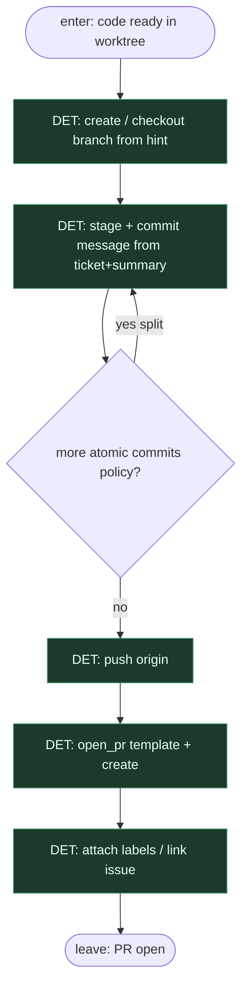

# Subgraph: git-pr

**Theme:** **all git / PR = DET** — branch, commit(s), push, open PR. Zero agent tool-calling na gicie.  
**Mode mix:** pure DET. Agenty tu nie wchodzą.

## Flow

## Invariant: DET-only git/PR

| Atom | Who |
|------|-----|
| branch create/checkout | DET |
| stage / commit | DET |
| push origin | DET |
| open pull request | DET |
| label / link issue | DET |

Agent **nie** woła `gh` / `git` z tool-callingu w tym wariancie. Jeśli hook wymaga wiadomości — bierze ją z ticket ID + implement summary (deterministyczny szablon).

## Notes

- **Implementer ceiling was code.** Ten subgraph jest jedynym miejscem, gdzie powstaje remote branch i PR.
- **One ticket → one PR.** Brak batchowania wielu issue w jeden PR.
- **Fail closed.** Push/PR atom fail → stop pass; nie „agent naprawi remote”.
- **Draft vs ready** zależy od MergePolicy / review policy na wyższym poziomie — atom `open_pr` jest zawsze DET.
- **Handoff contract.** Output = `{pr_url, branch, commit_shas, summary}` dla review-merge.
- **Polish:** cała nuda gita i PR to skrypt — dokładnie po to jest dual-light-agents.
