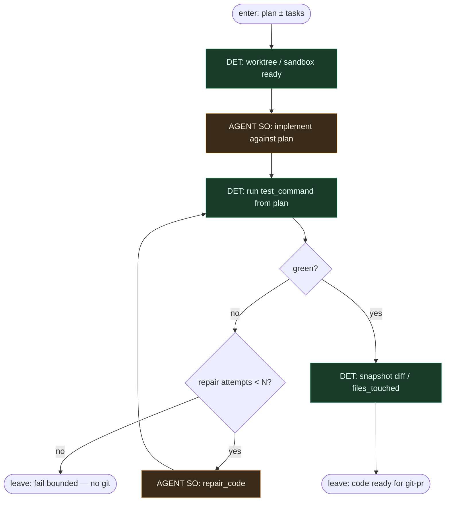

# Subgraph: implement

**Theme:** light agent #2 — **implement SO leaf**. Kod według planu; **bez gita i bez PR**.  
**Mode mix:** AGENT SO implement/repair; DET tylko local test gate (komenda z planu).

## Flow



## Structured output (`implement` / `repair_code`)

```json
{
  "ok": true,
  "summary": "...",
  "files_touched": ["..."],
  "tests_run": true
}
```

albo `{ "ok": false, "reason": "cant_comply"|"needs_split"|"blocked_path" }`.

## Notes

- **Ceiling = working tree + summary.** Ten liść **nie** robi `git commit`, **nie** pushuje, **nie** otwiera PR — to idzie do subgraph-git-pr (DET).
- **Plan is contract.** files / non_goals / stop_if; scope creep → `ok:false`, nie ciche rozszerzenie.
- **Bounded repair.** Max N; potem fail closed — bez nieskończonego self-healing theatre.
- **Local test gate is DET.** Komenda z planu; agent nie „uznaje zielonego” poza skryptem.
- **Meat ≡ AI.** To samo siedzenie AGENT dla pair-programming albo coding agenta.
- **Handoff contract.** Output = `{summary, files_touched, test_command, worktree_path}` dla git-pr.
- **Polish:** lekki agent #2 klepie kod; git i PR zostawia skryptom.
