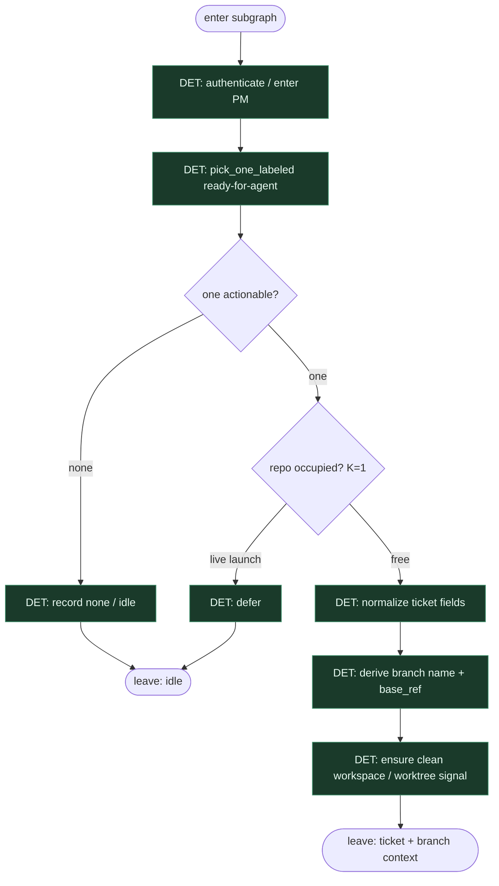

# Subgraph: intake

**Theme:** enter PM → pick one labeled job → normalize ticket → occupancy gate.  
**Mode mix:** pure DET. No planner, no coder here.

## Flow

## Notes

- **Label = start.** Tylko `ready-for-agent` / `ai:ready` (operator). Zero „weź z czatu”.
- **K=1 occupancy.** Jeden live launch na repo; defer zamiast równoległego chaosu.
- **Normalize once.** Title, ID, acceptance hints, links → stabilny payload dla plan leaf.
- **Fail closed.** Auth / pick fail → stop; nie wymyślaj roboty.
- **Handoff contract.** Output = `{ticket, branch_hint, base_ref}` dla subgraph-plan.
- **Polish:** drzwi wejściowe są skryptem — człowiek/agent wchodzi dopiero przy planie.
