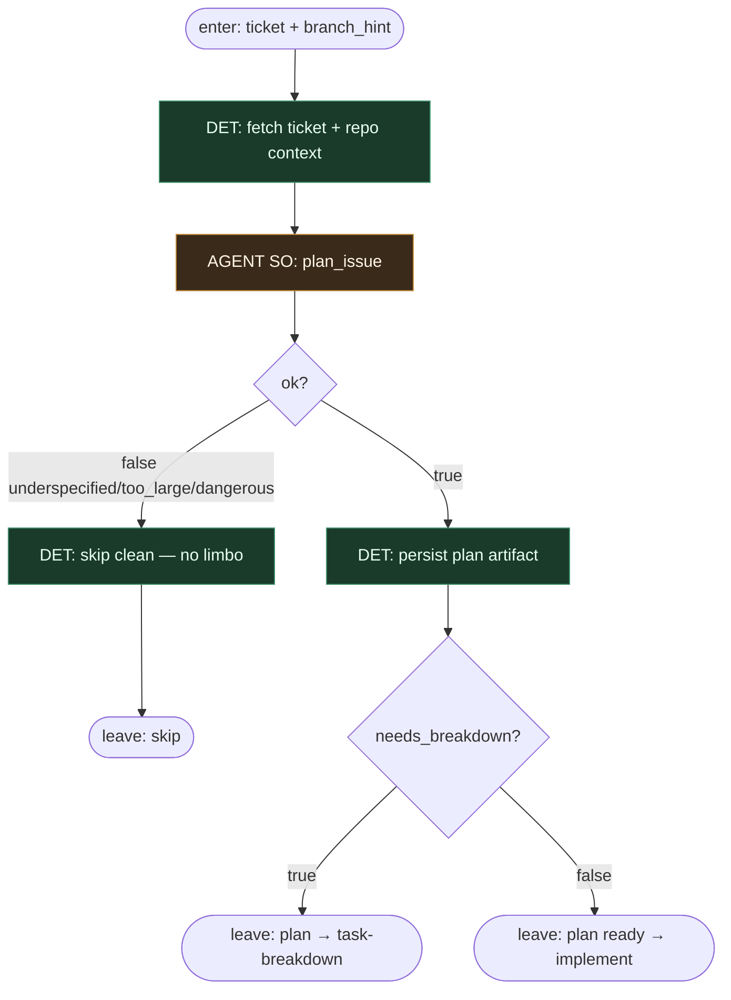

# Subgraph: plan

**Theme:** light agent #1 — **plan-only** structured output. Zero kodu, zero gita.  
**Mode mix:** DET context fetch; AGENT SO `plan_issue`.

## Flow



## Structured output (`plan_issue`)

```json
{
  "ok": true,
  "goal": "...",
  "files": ["..."],
  "test_command": "...",
  "non_goals": ["..."],
  "stop_if": ["auth", "migration"],
  "needs_breakdown": false
}
```

albo `{ "ok": false, "reason": "underspecified"|"too_large"|"dangerous" }` → skip bez limbo.

## Notes

- **Narrow seat.** Planista **tylko planuje** — nie pisze produktowego kodu, nie commit'uje, nie otwiera PR.
- **stop_if is sacred.** Auth, migrations, secrets → skip / escalate; implement nie „wing it”.
- **needs_breakdown** to flaga, nie obowiązek. Default = false → prosto do implement.
- **Scoping = dźwignia niezawodności.** Jakość planu > bravado modelu w coderze.
- **Handoff contract.** Output = `{ticket, plan, branch_hint, test_command, needs_breakdown}` .
- **Polish:** lekki agent #1 — rozpisuje jak zrobić issue; klepanie zostawia #2.
