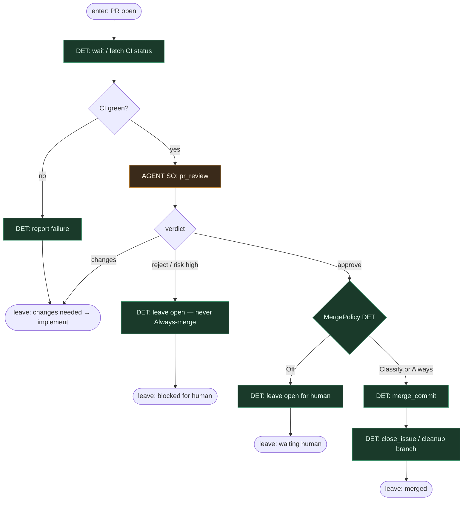

# Subgraph: review-merge

**Theme:** critical PR review (osobna rola) → MergePolicy DET.  
**Mode mix:** AGENT SO `pr_review`; DET CI wait + merge policy.

## Flow



## Structured output (`pr_review`)

```json
{
  "verdict": "approve"|"changes"|"reject",
  "reasons": ["..."],
  "risk": "low"|"high"
}
```

## Notes

- **Reviewer ≠ implementer.** Osobne siedzenie (mięso lub AI); zero self-approve.
- **QA strategy stays.** Niewygodne pytania (scope creep, brak testów, rollback) żyją w reasons.
- **CI is DET gate.** Agent nie override'uje czerwonego builda.
- **MergePolicy Off|Classify|Always.** Start zwykle Off lub Classify — nie L5 auto-merge theatre.
- **reject / high risk** blokuje Always; zostawia PR człowiekowi.
- **Changes-requested** wraca do implement (SO leaf), potem znowu przez git-pr DET — nie „agent pushuje z review”.
- **Handoff contract.** `{merged:true, merge_sha}` albo `{merged:false, feedback}` / `{waiting_human:true}`.
- **Polish:** krytyczny przegląd to osobna rola; merge to skrypt po zielonym werdykcie.
