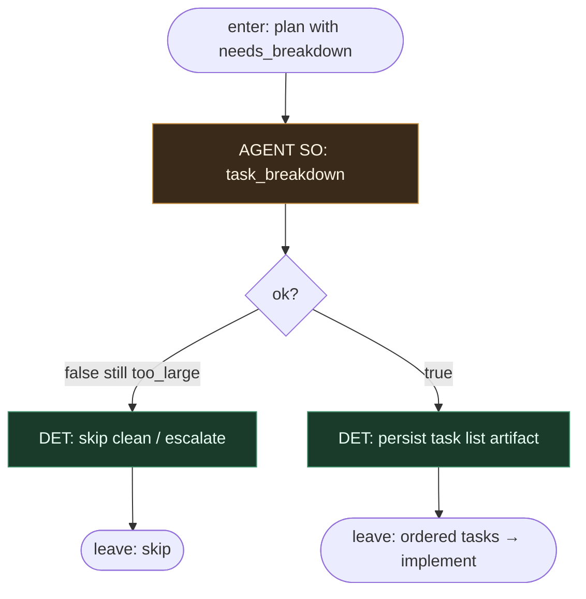

# Subgraph: task-breakdown (optional)

**Theme:** opcjonalny lekki AGENT SO — rozpisanie plików / tasków gdy plan lub ticket jest za gruby na jeden implement shot.  
**Mode mix:** AGENT SO; DET tylko persist. **Default path omija ten subgraph.**

## Flow



## Structured output (`task_breakdown`)

```json
{
  "ok": true,
  "tasks": [
    {
      "id": "t1",
      "title": "...",
      "files": ["..."],
      "done_when": "..."
    }
  ]
}
```

albo `{ "ok": false, "reason": "still_too_large"|"ambiguous" }` → skip / escalate, nie half-plan limbo.

## Notes

- **Optional by design.** Dual-light-agents działa bez tego liścia; włącza się tylko gdy `needs_breakdown` albo operator.
- **Nie jest trzecim orkiestratorem.** Nie wybiera następnego stage'u grafu — tylko rozbija scope na listę tasków dla implement.
- **Nie pisze kodu.** Breakdown ≠ implement; coder nadal jest osobnym SO leaf.
- **Bounded list.** Mała, uporządkowana lista; nie epicki backlog w środku passu.
- **Handoff contract.** Output = `{plan, tasks[]}` dla subgraph-implement (implement idzie task po tasku lub jednym shotem według polityki).
- **Polish:** gdy trzeba — rozpisz pliki/taski; gdy nie trzeba — pomiń i klep od razu.
