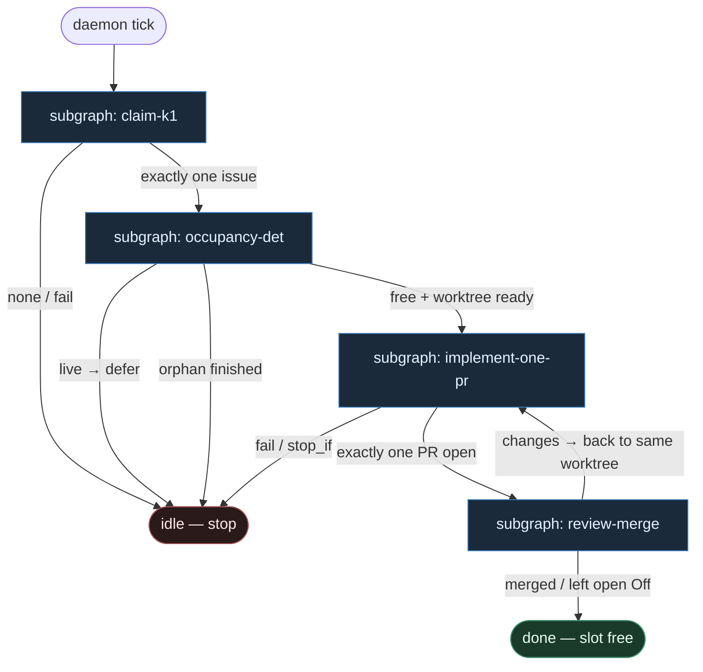

# 12 — Serial K=1 (strict)

**Persona:** serial-strict — twardy K=1: **jeden ticket, jeden worktree, jeden PR**; occupancy **wyłącznie DET**; **zakaz siewu katalogu mid-flight**.

**Approach:** from_scratch. Osobny graf + podgrafy tematyczne (nie monolit). Polish OK.

## Design notes

- **K=1 to prawo, nie wskazówka.** Pick zwraca 0|1. Worktree: dokładnie jeden path na misję. PR: dokładnie jeden otwarty na ten ticket. Drugi claim / drugi worktree / drugi PR = fail closed, nie „przy okazji”.
- **Serial, nie parallel.** Dopóki occupancy = `live` (worktree lub otwarty wrapper bez domknięcia), kolejny labeled ticket **czeka**. Brak fan-out, brak batcha, brak „katalogu równoległych misji”.
- **Occupancy = DET.** Probe `free | live | dead_orphan` to skrypt. Defer / finish_orphan / worktree_add — atomy. Zero LLM „czy wolno wejść”.
- **No catalog seeding mid-flight.** Od momentu claim do PR open (albo fail receipt) executor **nie** dopisuje nowych ticketów do katalogu pracy, nie pickuje sąsiada, nie otwiera drugiego worktree „na fix przy okazji”. Katalog jest zamknięty na czas misji.
- **DET majority.** List/filter/pick, occupancy, worktree, test, commit, push, open PR, CI, merge policy — skrypty. AGENT tylko w liściach: implement (+ opc. thin plan) i critical review.
- **Coder ≠ merge.** Implement kończy się na otwartym PR (albo fail). Merge = osobny klaster policy Off|Classify|Always.
- **Meat ≡ AI.** To samo siedzenie AGENT; graf nie rozróżnia.
- **NOT L5.** Cel z SOUL: zdjąć wyczerpujące klepanie ticket→branch→PR→merge. Człowiek zostaje przy architekturze, trudnych decyzjach i (gdy Off) merge.
- **Kryterium:** zmergowany (albo świadomie otwarty przy Off) `ai/fix` na tipie hosta — nie ładny JSON `outcome=none` i nie dwa PR-y z jednego ticka.

## Top-level flowchart

**DET vs AGENT at a glance**

| Layer | Mode | K=1 / serial rule |
|-------|------|-------------------|
| Claim labeled | DET | `pick_one_k1` — nigdy tablica |
| Occupancy probe / defer / orphan | DET | slot 0\|1; live = czekaj |
| Worktree add + install | DET | jeden path; zakaz drugiego mid-flight |
| Implement (+ opc. plan) | AGENT SO | tylko w zarezerwowanej komórce |
| Test / commit / push / open PR | DET | dokładnie jeden PR `Closes #N` |
| Critical review | AGENT SO | osobna rola; verdict structured |
| Merge Off\|Classify\|Always | DET | nigdy LLM-merge |
| Catalog seed during ship | — | **FORBIDDEN** |

## Index of subgraphs

| File | Theme | Role in chain |
|------|--------|----------------|
| [subgraph-claim-k1.md](./subgraph-claim-k1.md) | label → exactly one | DET front door; serial pick |
| [subgraph-occupancy-det.md](./subgraph-occupancy-det.md) | free\|live\|orphan → one worktree | 100% DET occupancy |
| [subgraph-implement-one-pr.md](./subgraph-implement-one-pr.md) | code → test → **one** PR | AGENT leaf + DET git; no mid-flight seed |
| [subgraph-review-merge.md](./subgraph-review-merge.md) | CI → review → policy | AGENT review + DET merge; slot free on exit |

## Invariants (serial-strict)

1. `one_ticket_per_pass` — pick = 0\|1
2. `one_worktree_per_ticket` — brak drugiego path w trakcie misji
3. `one_pr_per_ticket` — jeden open PR; drugi = fail
4. `occupancy_is_det` — probe/defer/orphan/add bez LLM
5. `no_catalog_seed_mid_flight` — od claim do done/fail katalog zamknięty
6. `serial_not_parallel` — live occupancy blokuje kolejny claim
7. `coder_ceiling_is_open_pr` — merge poza implementerem
8. `subgraphs_not_monolith` / `not_l5`

## Antyteza (czego tu nie ma)

- Parallel K>1 / fan-out worktrees
- Siew katalogu ticketów w środku implementacji
- Agent wybierający „przy okazji sąsiada”
- Occupancy jako prompt LLM
- Mega-branch / multi-issue PR
- L5 lights-out / wymyślanie pracy z czatu
