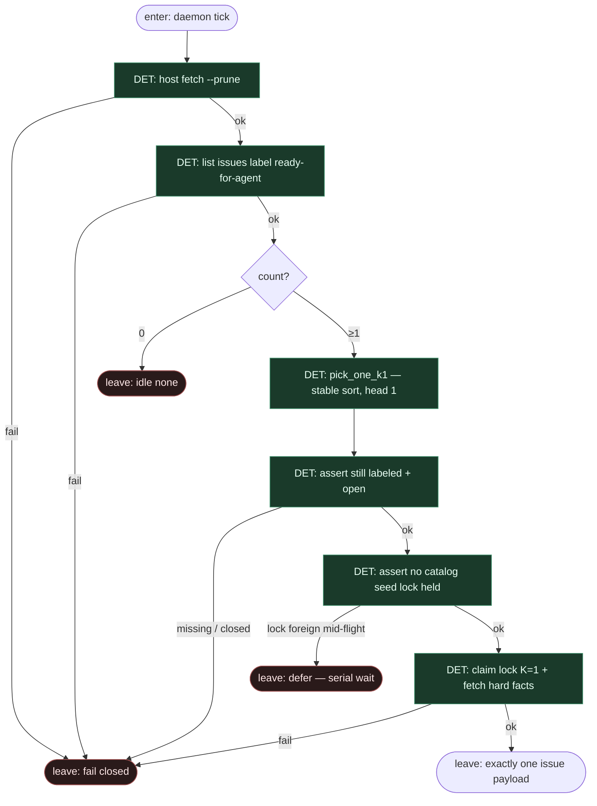

# Subgraph: claim-k1

**Theme:** label → exactly one ticket (serial front door).  
**Mode mix:** 100% DET. Zero LLM.  
**Handoff out:** `{ok:true, issue, label, repo}` albo `{ok:false, reason:none|auth|api|label_missing}` → idle.

## Flow

## DET atoms

| Atom | ok means | fail / side |
|------|----------|-------------|
| `host_ff` | tip hosta świeży | `fetch_failed` |
| `list_labeled_ready` | JSON lista labeled | `api` / `auth` |
| `pick_one_k1` | dokładnie 0\|1 issue | `none` (0) — legalny idle |
| `assert_label_open` | etykieta + open | `label_missing` / `closed` |
| `assert_no_foreign_seed_lock` | brak cudzej misji mid-flight | `defer_serial` |
| `claim_lock_k1` | lock = ten issue; katalog zamknięty | `lock_failed` |
| `fetch_issue_hard_facts` | title, body, number, labels | `api` |

## Notes

- **Etykieta = start.** Zero „weź z czatu”. Brak labela → nie pickujemy.
- **K=1 w picku.** `pick_one_k1` **nigdy** nie zwraca tablicy do równoległego siewu. Reszta labeled czeka na kolejny tick po zwolnieniu slotu.
- **Serial wait.** Jeśli inna misja trzyma seed-lock / occupancy live — defer, nie „dorzuć do katalogu”.
- **`none` ≠ awaria.** Legalny terminal → receipt idle.
- **Bez triage AGENT.** Twarde fakty z issue; brak acceptance → problem szablonu, nie LLM tu.
