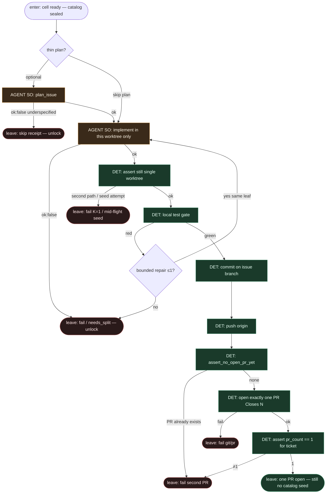

# Subgraph: implement-one-pr

**Theme:** AGENT implement w **jednej** komórce → test DET → commit/push → **dokładnie jeden** PR.  
**Mode mix:** AGENT SO (implement, opc. thin plan) + DET git/PR.  
**Handoff in:** worktree ready (catalog sealed).  
**Handoff out:** `{ok:true, pr_url, branch, closes: N}` albo fail/skip receipt — **bez** siewu katalogu.

## Flow

## AGENT leaves (structured output)

| Leaf | Schema (ok) | Schema (fail) |
|------|-------------|-----------------|
| `plan_issue` *(opc.)* | `{ok, goal, files, test_command, non_goals, stop_if}` | `{ok:false, reason: underspecified\|too_large\|dangerous}` |
| `implement` | `{ok, summary, files_touched, tests_run}` | `{ok:false, reason: cant_comply\|needs_split\|blocked_path}` |

## DET atoms (git / K=1 guards)

| Atom | ok means | fail |
|------|----------|------|
| `assert_single_worktree` | path count = 1 dla misji | `k1_violation` |
| `forbid_catalog_seed` | brak nowych ticket entries w runtime catalog | `mid_flight_seed` |
| `local_test` | test_command exit 0 | `test_red` |
| `commit_issue_branch` | commit na `ai/issue-N-…` | `git_failed` |
| `push_origin` | remote updated | `push_failed` |
| `assert_no_open_pr_yet` | 0 open PR dla issue | `pr_already_open` |
| `open_pr_closes_n` | dokładnie 1 PR, body `Closes #N` | `pr_failed` |
| `assert_pr_count_one` | count(open+just_created)=1 | `k1_pr_violation` |

## Notes

- **No catalog seeding mid-flight.** Między enter a leave executor **nie** woła pick/list do dorzucenia sąsiada, **nie** `worktree add` drugiego path, **nie** otwiera drugiego PR. Guardy DET to egzekwują.
- **Jedna komórka.** Implement czyta tylko cell context (issue + allow_paths). Zakaz „przy okazji zrób #N+1”.
- **Jedna szansa repair lokalnie.** Test czerwony → max 1 bounded retry w tym samym liściu **albo** fail + unlock. Nie zagnieżdżony SDLC i nie nowy worktree.
- **Coder ceiling = open PR.** Merge nie żyje tutaj.
- **Meat ≡ AI.** Ten sam kontrakt SO niezależnie kto siedzi w liściu.
