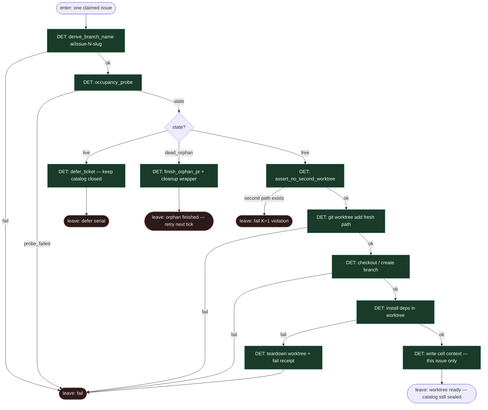

# Subgraph: occupancy-det

**Theme:** occupancy probe → defer | orphan finish | **one** fresh worktree.  
**Mode mix:** 100% DET. Occupancy **nigdy** nie jest liściem LLM.  
**Handoff in:** one issue payload + claim lock.  
**Handoff out:** `{ok:true, worktree_path, branch, base_sha}` albo defer/orphan/fail → receipt.

## Flow

## Occupancy states (DET enum)

| State | Meaning | Action |
|-------|---------|--------|
| `free` | brak live launch / worktree na ten slot | `worktree_add` (jeden) |
| `live` | aktywna misja / żywy wrapper | `defer` — serial wait |
| `dead_orphan` | martwy wrapper bez domkniętego PR | `finish_orphan_pr` + cleanup |

## DET atoms

| Atom | ok means | fail |
|------|----------|------|
| `derive_branch_name` | deterministyczny `ai/issue-N-slug` | `bad_issue_id` |
| `occupancy_probe` | `{state}` zawsze gdy probe żyje | `probe_failed` |
| `defer_ticket` | zapis deferred; **bez** siewu katalogu | `write_failed` |
| `finish_orphan_pr` | wrapper domknięty / sprzątnięty | `cleanup_failed` |
| `assert_no_second_worktree` | ≤1 path dla misji | `k1_violation` |
| `worktree_add` | świeży czysty path | `path_busy` / `git_failed` |
| `checkout_issue_branch` | branch na worktree | `git_failed` |
| `install_deps` | lockfile install OK | `install_failed` |
| `write_cell_context` | issue-only + allow_paths | `write_failed` |

## Notes

- **Occupancy DET.** Żaden prompt nie decyduje „czy wolno”. Diamond/skrypt na `state`.
- **Jeden worktree.** `assert_no_second_worktree` + `worktree_add` — executor **nie** tworzy drugiego katalogu „na hotfix” w trakcie.
- **Catalog sealed.** Defer nie dopisuje sąsiadów do kolejki runtime; labeled issues zostają w PM, nie w mid-flight catalog.
- **Fail closed na git/install.** Czerwony → teardown + stop; nie „agent naprawi FS”.
- **Handoff:** komórka = `{worktree_path, branch, base_sha, issue_payload, allow_paths[]}` — wąski kontekst pod następny liść.
