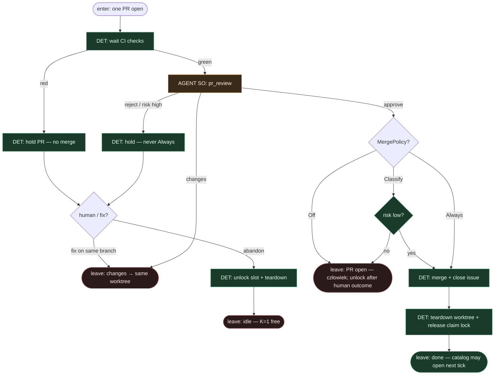

# Subgraph: review-merge

**Theme:** CI DET → critical review SO → merge policy DET → **zwolnienie slotu K=1**.  
**Mode mix:** DET CI/policy + AGENT review (osobna rola).  
**Handoff in:** exactly one PR open for the ticket.  
**Handoff out:** merged | left open (Off/high) | changes → back to **same** worktree (no new claim).

## Flow

## AGENT leaf

**`pr_review`** → `{verdict: approve|changes|reject, reasons[], risk: low|high}`  
- `reject` / `risk:high` → **nigdy** Always-merge  
- `reasons[]` nosi niewygodne pytania QA (bez osobnego QA-strategy AGENT)

## DET policy

| Knob | Zachowanie |
|------|------------|
| **Off** *(default)* | PR zostaje otwarty; człowiek merguje; slot zwalniany po human outcome / explicit unlock |
| **Classify** | auto-merge tylko `approve` + `risk:low` + CI green |
| **Always** | merge gdy CI green **i** verdict ≠ reject **i** risk ≠ high |

## Notes

- **Changes → ten sam worktree.** Nie nowy claim, nie nowy path, nie siew katalogu. K=1 trwa do done/abandon.
- **Slot free dopiero na exit.** `release claim lock` + teardown po merge/abandon/human Off outcome — dopiero wtedy kolejny tick może `pick_one_k1`.
- **Reviewer ≠ implementer.** Osobna rola SO; brak write do kodu w tym liściu (opcjonalnie enforced allowlist).
- **Merge jest DET.** Gałka Off\|Classify\|Always — nie prompt „czy zmergować”.
- **NOT L5.** Off default trzyma człowieka przy merge gdy polityka tak każe; graf zdejmuje klepanie, nie odpowiedzialność.
