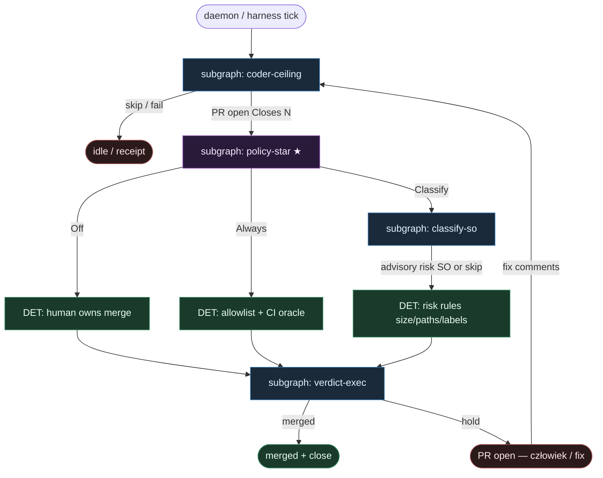

# 13 — Merge Policy (star)

**Persona:** merge-policy-first — maksymalna wierność gałce [ready-for-agent](https://github.com/berenddeboer/ready-for-agent) **Merge Policy Off | Classify | Always**; reszta łańcucha to feeder.

**Approach:** `reuse_ready`. Nie nowa religia merge — bierzemy kanoniczną gałkę KLEPACZ / ready-for-agent i stawiamy ją w centrum grafu.

## Design notes

- **MergePolicy = gwiazda.** Off | Classify | Always to nie „ostatni akapit w README” — to hub po otwartym PR. Wszystkie ścieżki zbiegają w policy; verdict jest DET.
- **Coder never merges.** Implementer (meat ≡ AI) kończy na `open PR Closes #N`. Zero `gh pr merge` w liściu kodera. Sufit = PR.
- **Classify AGENT SO tylko gdy Classify.** Off i Always **nigdy** nie wołają classify-agenta. SO ryzyka jest gated: `policy == Classify` → opcjonalny advisory leaf; inaczej skip SO, czyste DET.
- **Default Off.** Start bezpieczny: klepacz pisze PR, człowiek merguje. Auto-merge = polityka, nie religia.
- **Always = wąski DET allowlist.** Docs / lockfile / tiny fix+test gdy CI jest wyrocznią. Bez LLM „czy warto”.
- **Classify = DET risk rules + opc. SO.** Size, chronione ścieżki, labels, CI; SO może dorzucić `risk`/`reasons[]` — **nie** autoryzuje merge.
- **Fail-closed.** Czerwone CI, brak required checks, konflikt → hold. Zero agent override.
- **DET majority.** Label pick, worktree, commit/push/PR, CI wait, policy switch, merge/hold = skrypt. Entropia tylko w implement leaf (+ Classify SO gdy włączone).
- **NOT L5.** Zdejmujemy babysitting merge *gdy polityka na to pozwala*. Człowiek zostaje przy Off / high Classify — energia na architekturę i niewygodne pytania QA (SOUL).
- **Kryterium:** zmergowany `ai/fix` na tipie hosta gdy policy pozwala — albo świadomy hold. Nie ładny JSON bez skutku.

## Top-level flowchart

**DET vs AGENT at a glance**

| Layer | Mode | Merge? | Uwaga |
|-------|------|--------|-------|
| Label pick / worktree / implement → PR | DET + AGENT implement leaf | **never** | coder ceiling = open PR |
| Policy star Off\|Classify\|Always | **DET knobs** | routes | reuse ready-for-agent |
| Off | DET | human | no classify SO |
| Always | DET allowlist + CI | yes if narrow | no classify SO |
| Classify SO | **AGENT SO only if Classify** | **never** | advisory `risk` only |
| Classify DET rules | DET | yes if low | size/paths/labels + SO fields |
| Verdict exec merge/hold | DET | executes | fail-closed |

## Index of subgraphs

| File | Theme | Role in chain |
|------|--------|----------------|
| [subgraph-coder-ceiling.md](./subgraph-coder-ceiling.md) | label → implement → open PR | feeder; **coder ≠ merge** |
| [subgraph-policy-star.md](./subgraph-policy-star.md) | Off \| Classify \| Always | **★ hub** — gałka per repo |
| [subgraph-classify-so.md](./subgraph-classify-so.md) | classify AGENT SO | **tylko gdy Classify**; advisory |
| [subgraph-verdict-exec.md](./subgraph-verdict-exec.md) | CI + merge/hold | DET execution after policy |

## Mapowanie na kanon KLEPACZ / SOUL

| Pewniaczek | Tu |
|------------|----|
| Merge Off/Classify/Always | ★ policy-star + verdict-exec |
| Coder ≠ merge | coder-ceiling sufit = open PR |
| Structured output LLM | implement w coder-ceiling; classify SO **gated** |
| Label = start | DET pick w coder-ceiling |
| NOT L5 / człowiek przy wartości | Off / high → human; Always wąski |

## Antyteza (czego tu nie ma)

- LLM „MergePolicy Classify” jako prompt bez gałki DET
- Classify SO wołany przy Off lub Always
- Coder / implement leaf z `gh pr merge`
- Fat monolit z merge w środku implementera
- L5 lights-out / agent pick z czatu
