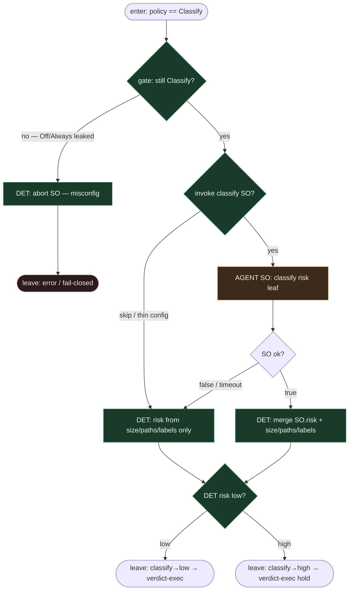

# Subgraph: classify-so

**Theme:** AGENT structured output **tylko gdy MergePolicy = Classify**. Advisory risk — nigdy merge.  
**Mode mix:** AGENT SO gated + DET risk rules po SO.

## Flow

## Notes

- **Hard gate.** Ten podgraf **istnieje wyłącznie dla Classify**. Off / Always nigdy tu nie wchodzą (policy-star nie routuje). Podwójny check na wejściu = fail-closed przy misconfig.
- **SO ≠ merge.** Kontrakt: `{risk: low|high, reasons[], paths_of_concern[]}` — advisory. Autorzyzacja merge zostaje w DET + verdict-exec.
- **Opcjonalność.** Repo może mieć Classify bez wołania agenta (same reguły DET). SO jest *dozwolone* tylko tu — nie *obowiązkowe*.
- **Nie LLM classifier gałki.** Model nie ustawia Off/Always. Gałka już jest Classify; SO tylko szacuje ryzyko PR.
- **High → hold bias.** `risk:high` / chronione ścieżki (auth, billing, schema) → hold dla człowieka (SOUL: trudne decyzje zostają).
- **Handoff.** `{policy: Classify, risk: low|high, reasons, pr_url}` → subgraph-verdict-exec.
