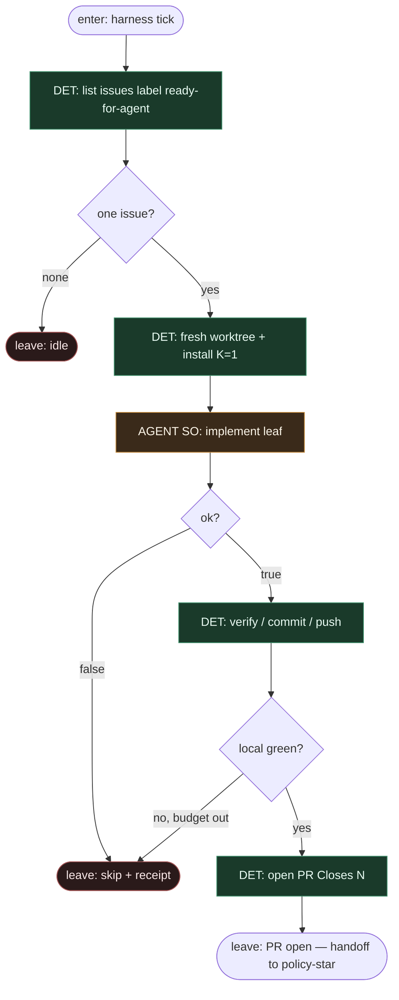

# Subgraph: coder-ceiling

**Theme:** łańcuch do otwartego PR — **coder never merges**. Sufit = `PR open Closes #N`.  
**Mode mix:** DET spine + AGENT implement leaf; zero merge auth.

## Flow

## Notes

- **Reuse ready-for-agent.** Label = start; fresh worktree; headless agent w liściu. Feeder pod ★ MergePolicy — nie osobna religia.
- **Coder ≠ merge.** Ani meat, ani AI w tym podgrafie nie woła merge. Brak przycisku, brak toola, brak „skoro CI zielone to zmergujemy w implementerze”.
- **Handoff.** Output = `{pr_url, issue_n, branch, commit_shas}` → **subgraph-policy-star**. Albo `{skip, reason}`.
- **Meat ≡ AI.** To samo siedzenie AGENT; graf bez zmian (SOUL).
- **Bounded.** Fail / underspecified / blocked_path → skip + receipt, nie limbo.
