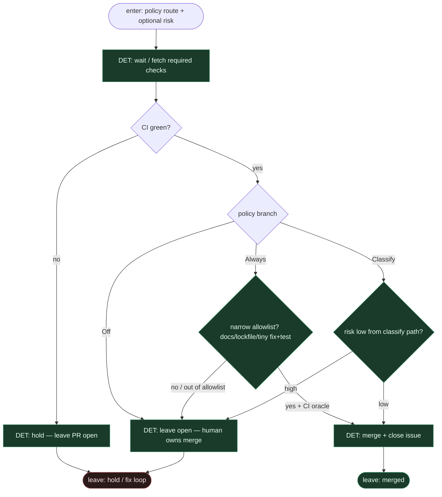

# Subgraph: verdict-exec

**Theme:** po decyzji policy — CI wait + **DET** merge albo hold. Jedyny miejsca z `merge` w wariancie 13.  
**Mode mix:** 100% DET. Zero AGENT.

## Flow

## Notes

- **Jedyny merge seat.** Coder-ceiling nie merguje; classify-so nie merguje; policy-star tylko routuje. Tu skrypt wykonuje `allow → merge` albo `hold`.
- **Fail-closed.** Czerwone CI, brak checks, konflikt → hold. Agent nie nadpisuje.
- **Always wąski.** Nawet przy Always: poza allowlistą → human (jak Off).
- **Classify high = Off behavior.** Świadomy hold — energia człowieka na architekturę / QA, nie na klepanie kolejki.
- **Handoff contract.** `{merged:true, merge_sha, issue_closed}` albo `{merged:false, policy: Off|Classify|Always, reason, pr_url}`.
- **NOT L5.** Auto-merge gdy polityka zielona ≠ lights-out bank.
