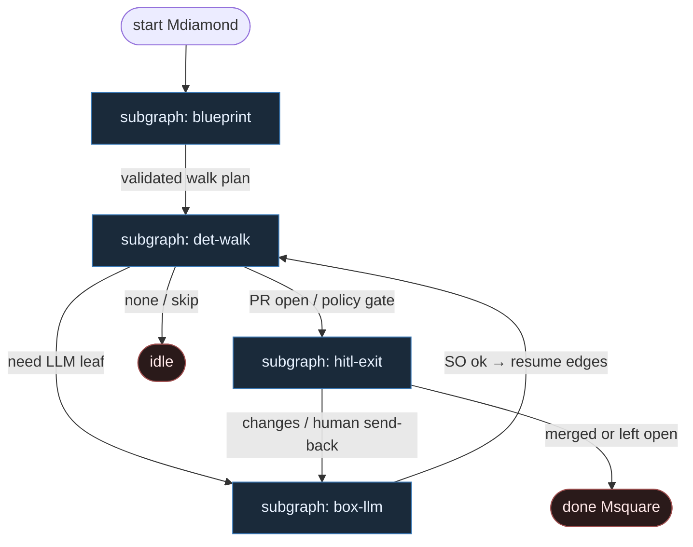

# 14 — DOT Pipeline (Attractor compose)

**Persona:** dot-pipeline compose — `blueprint.dot` jest programem; `PipelineRunner` chodzi po grafie; LLM **tylko** wypełnia węzły `shape=box`.

**Approach:** compose. Mapowanie StrongDM Attractor / samueljklee·az9713·jhugman·campallison na duszę klepacza (ticket→PR, nie L5). Graph-is-code; agent is leaf.

## Design notes

- **Graf = kod.** Topologia żyje w `blueprint.dot` (albo równoważnym DOT). Zmiana procesu = edycja DOT + validate — nie „agent wymyśla następny krok”.
- **PipelineRunner jest DET.** Parser DOT + walk krawędzi + checkpoint/SSE + retry policy = silnik Python/Go/TS. Zero LLM w orkiestracji.
- **LLM fills nodes only.** Węzeł `shape=box` + `prompt=` / schema = jedyne miejsce entropii. Structured output; `ok:false` = skip/escape, nie limbo.
- **Shape → rola (kanon Attractora).**
  - `parallelogram` — tool/shell DET (pick label, worktree, test, git, open PR, merge)
  - `diamond` — warunek DET (occupancy, CI green, merge policy branch)
  - `box` — LLM leaf (plan / implement / review)
  - `hexagon` — HITL (MergePolicy Off, high-risk hold)
  - `Mdiamond` / `Msquare` — start / done
- **Klepacz, nie software-factory-from-scratch.** Blueprint wiąże się z wąskim łańcuchem: labeled issue → worktree → plan SO → implement SO → test DET → open PR → review SO → merge policy — nie research→design→SSG.
- **Meat ≡ AI w boxie.** To samo siedzenie; silnik nie rozróżnia.
- **NOT L5.** Cel: zdjąć wyczerpujące klepanie między ticketem a PR; człowiek zostaje przy architekturze, trudnych decyzjach i (gdy Off) merge.
- **Jeden ticket, jeden PR.** K=1; runner nie sieje katalogu w środku boxa.
- **Fail closed.** Czerwony test / `ok:false` / brak labela → bounded retry w liściu albo exit — nie gruby mózg „napraw wszystko”.

## Top-level flowchart

**DET vs AGENT at a glance**

| Shape / layer | Mode | Responsibility |
|---------------|------|----------------|
| blueprint load + validate | DET | Parse DOT, bind klepacz stage ids, reject unknown shapes |
| PipelineRunner walk | DET | Edge order, checkpoint, diamond conditions, retries |
| parallelogram tools | DET | pick_one_labeled, worktree, test, commit, push, open_pr, merge |
| box leaves | AGENT SO | plan_issue, implement, pr_review — LLM fills only |
| hexagon | HITL | MergePolicy Off / high-risk hold — nie LLM |
| agent routing / fat tool-loop | — | **FORBIDDEN** — graf już jest kodem |

## Index of subgraphs

| File | Theme | Role in chain |
|------|--------|----------------|
| [subgraph-blueprint.md](./subgraph-blueprint.md) | Load + validate `blueprint.dot` | DET front: graph-is-code |
| [subgraph-det-walk.md](./subgraph-det-walk.md) | Runner + parallelogram + diamond | DET spine ticket→PR plumbing |
| [subgraph-box-llm.md](./subgraph-box-llm.md) | `shape=box` leaves | LLM fills nodes only |
| [subgraph-hitl-exit.md](./subgraph-hitl-exit.md) | hexagon + merge policy exit | HITL / DET policy → done |

## Compose map (Attractor → klepacz)

| Attractor concept | Klepacz seat |
|-------------------|--------------|
| `PipelineRunner` / `parse_dot` | daemon tick + fixed FSM (nie department orkiestrator) |
| `software_factory.dot` stages | thin ticket→PR blueprint (nie full product mill) |
| CodergenHandler / box prompt | plan / implement / review SO leaves |
| `check_cmd` / shell tool | DET test gate + git/PR atoms |
| hexagon Review | MergePolicy Off + human outcome / high risk |
| validate without API key | DET: DOT schema + shape_map check before any LLM |

## Kryterium sukcesu

Człowiek ma energię na architekturę i niewygodne pytania — bo nie spalił dnia na walk/git/PR. Technicznie: runner przechodzi `blueprint.dot` do otwartego (i opcjonalnie zmergowanego) `ai/fix` na tipie hosta; LLM nigdy nie wybiera następnego węzła.
