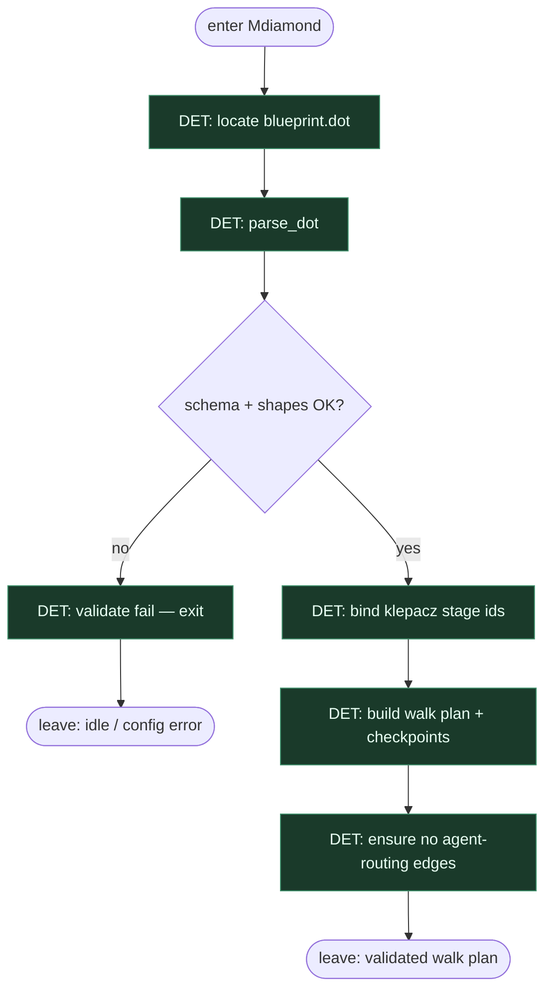

# Subgraph: blueprint

**Theme:** załaduj i zwaliduj `blueprint.dot` — graf jest kodem.  
**Mode mix:** 100% DET. Zero LLM.

## Flow

## Notes

- **Graph-is-code.** Zmiana procesu = edycja DOT, nie prompt „zrób inaczej dziś”.
- **Validate bez API key.** Jak samueljklee/attractor: zły shape / brak start-exit / nieznany tool = fail przed pierwszym boxem.
- **Shape allowlist.** Tylko Mdiamond, Msquare, box, parallelogram, diamond, hexagon. Inne → reject.
- **Bind do klepacza.** Stage ids mapują się na atomy: `pick_one_labeled`, `worktree_add`, `plan_issue`, `implement`, `run_tests`, `open_pr`, `pr_review`, `merge_policy` — nie research/SSG theatre.
- **Handoff contract.** Output = `{dot_ast, walk_plan, stage_bind, checkpoint_store}` dla det-walk.
