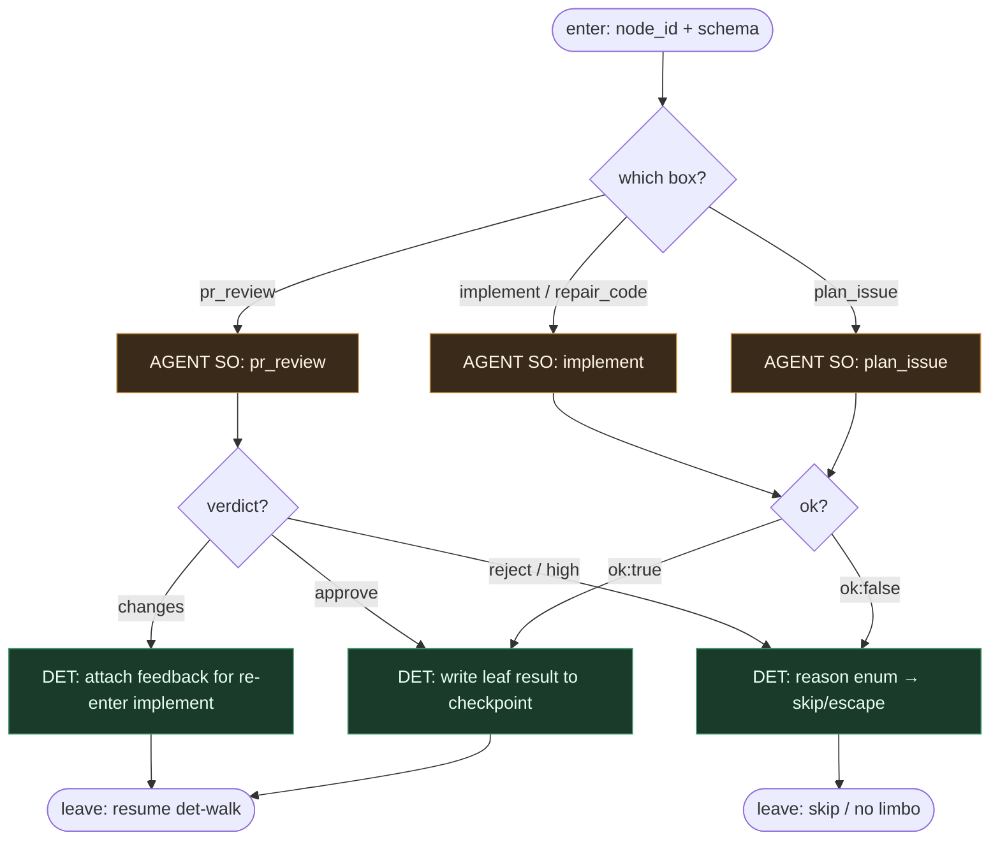

# Subgraph: box-llm

**Theme:** `shape=box` — LLM **tylko** wypełnia węzeł (structured output).  
**Mode mix:** AGENT SO leaves. Zero git, zero routingu, zero tool-calling orkiestratora.

## Flow



## Notes

- **LLM fills nodes only.** Box dostaje prompt + JSON schema; zwraca obiekt. Nie woła „następnego toola z listy świata”.
- **Trzy liście klepacza (kanon).**
  - `plan_issue` — goal, files, test_command, non_goals, stop_if
  - `implement` / `repair_code` — summary, files_touched; max N bounded
  - `pr_review` — verdict approve\|changes\|reject + reasons + risk
- **Coder ≠ merge ≠ open_pr.** Implement nie otwiera PR i nie merjuje — to parallelogram w det-walk.
- **Reviewer ≠ implementer.** Osobny box / osobne siedzenie; nigdy self-stamp.
- **ok:false bez limbo.** underspecified \| too_large \| dangerous \| cant_comply → skip; park labels wyłączone.
- **Meat ≡ AI.** Człowiek może wypełnić ten sam schema ręcznie; runner nie wie.
- **Handoff contract.** Output = `{node_id, so_payload, resume_edge}` albo `{ok:false, reason}` dla det-walk.

## Structured output (skrót)

```json
{ "ok": true, "goal": "...", "files": ["..."], "test_command": "...", "non_goals": ["..."], "stop_if": ["auth","migration"] }
```

```json
{ "ok": true, "summary": "...", "files_touched": ["..."], "tests_run": true }
```

```json
{ "verdict": "approve"|"changes"|"reject", "reasons": ["..."], "risk": "low"|"high" }
```
