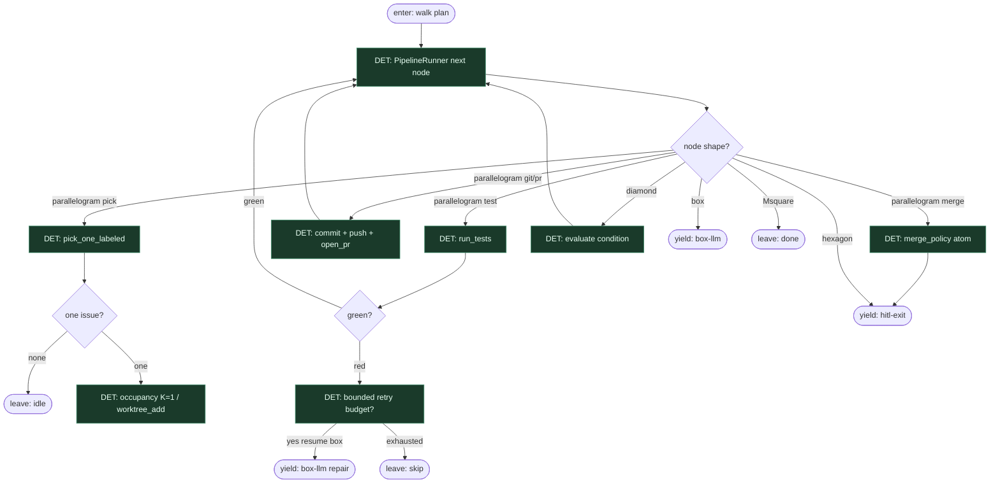

# Subgraph: det-walk

**Theme:** `PipelineRunner` chodzi po krawędziach; parallelogram = tool/shell; diamond = warunek.  
**Mode mix:** DET spine. Wzywa box-llm tylko gdy natrafi na `shape=box`.

## Flow

## Notes

- **Runner nie myśli.** Kolejność = krawędzie DOT + wynik diamond. Żaden AGENT nie wybiera „co dalej”.
- **Parallelogram = skrypt.** pick / worktree / test / commit / push / open_pr / merge_policy — atomy DET z WORKING_KLEPACZ_GRAPH.
- **Yield, nie orkiestracja.** Natrafienie na box/hexagon = przekazanie do subgraphu liścia; po SO/HITL resume na tej samej krawędzi.
- **Checkpoint.** Po każdym węźle stan walki; restart bez ponownego „agent odkrywa świat”.
- **K=1 occupancy.** Live launch → defer; dead wrapper → finish_orphan_PR; free → worktree — wszystko DET diamond/parallelogram.
- **Handoff contract.** Yield box = `{node_id, prompt_ref, schema, ticket_ctx}`; yield hitl = `{pr, review_verdict, policy}`; leave idle/skip/done = receipt.
