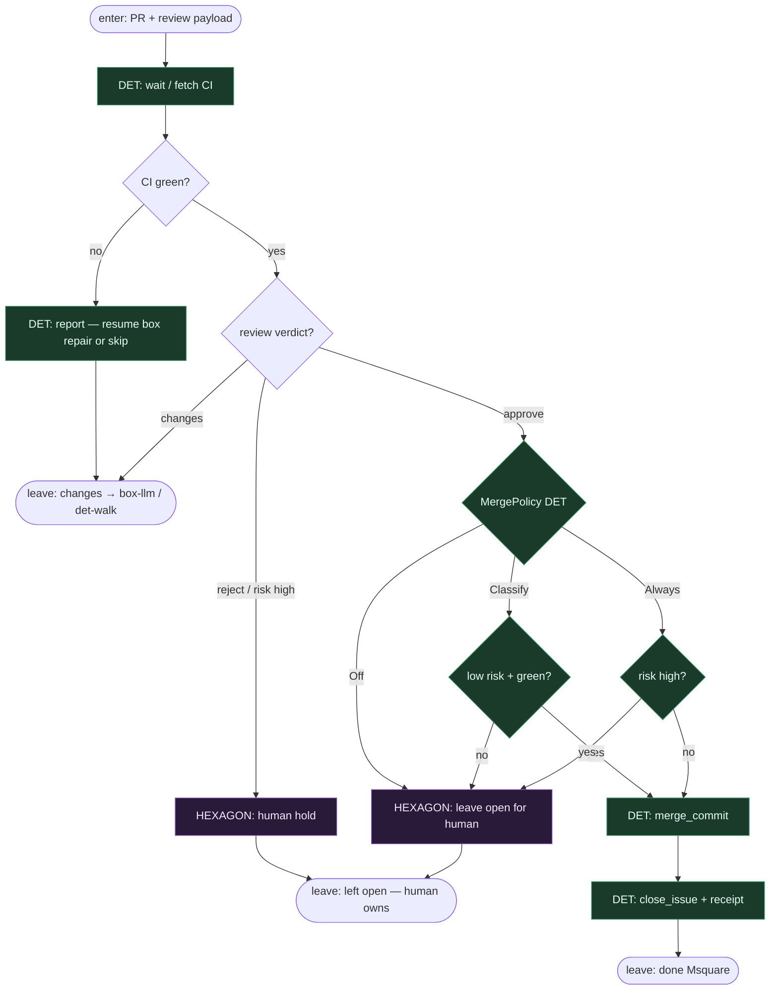

# Subgraph: hitl-exit

**Theme:** `shape=hexagon` + MergePolicy — wyjście z walka bez LLM-merge theatre.  
**Mode mix:** HITL + DET policy. Zero box LLM w decyzji merge Always przy risk=high.

## Flow

## Notes

- **Hexagon ≠ box.** Human gate nie jest „LLM udającym człowieka”. Off default = klepacz kończy na otwartym PR.
- **MergePolicy Off \| Classify \| Always.** Gałka DET; Always nigdy przy `risk=high` / reject.
- **CI jest wyrocznią DET.** AGENT nie nadpisuje czerwonego builda.
- **Changes → z powrotem do box implement** przez det-walk (bounded), nie osobny fat repair department.
- **NOT L5.** Ludzie odpowiadają za skutek przy Off i przy high-risk; runner tylko doprowadza do bramki.
- **Handoff contract.** `{merged:true, merge_sha}` \| `{merged:false, left_open:true}` \| `{merged:false, feedback}` → receipt / resume.
