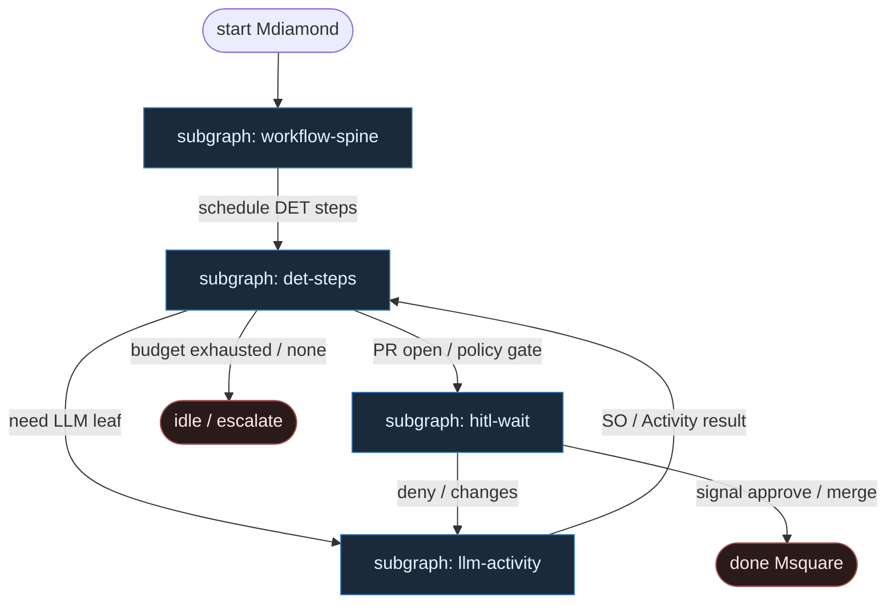

# 15 — Durable Steps (Temporal / Inngest)

**Persona:** durable-steps compose — Temporal Workflow / Inngest function = DET spine z checkpointami; LLM **wewnątrz** jednego `Activity` / `step.run`, nigdy jako router grafu.

**Approach:** compose. Mapowanie P2.1 Durable Workflow Orchestration + Inngest step functions na duszę klepacza (ticket→PR, nie L5). Durability poza context window modelu.

## Design notes

- **Workflow jest DET.** Ciało Temporal Workflow / Inngest function: kolejność kroków, pętle retry, timeouts, `waitForEvent` / Signal — zwykły kod. Zero LLM w orkiestracji (Temporal: nondeterminism na replay).
- **Checkpoint = Event History / step memo.** Crash workera, restart procesu, blip inference → wznów od padniętego kroku; udane kroki nie lecą ponownie.
- **Retry dotyczy kroku, nie misji.** `Activity` / `step.run` ma własny timeout + maxAttempts. Fail test → bounded re-entry do LLM Activity; wyczerpany budżet → escalate / skip, nie „agent napraw świat”.
- **LLM inside one step.** Coding agent / plan SO / review SO żyją **w** Activity lub `step.run("implement", …)`. Nie wybierają następnego węzła; wynik Activity (ok|fail + artefakt) steruje Workflow.
- **HITL = wait, nie chat-loop.** `step.waitForEvent` / Workflow Signal (approve/deny) albo MergePolicy Off. Człowiek nie trzyma otwartego procesu w RAM.
- **Meat ≡ AI w tym samym slocie.** Ten sam Activity contract; silnik nie rozróżnia kto wypełnił SO.
- **Jeden ticket, jeden PR.** K=1; Workflow per issue; occupancy/worktree to DET Activities.
- **NOT L5.** Cel: zdjąć wyczerpujące klepanie; merge zostaje przy polityce / człowieku.

## Top-level flowchart

**DET vs AGENT at a glance**

| Layer | Mode | Responsibility |
|-------|------|----------------|
| Workflow / Inngest function body | DET | Order, loops, timeouts, continue-as-new; replay-safe |
| Event History / step memo | DET | Source of truth; resume without re-prompting world |
| hydrate, worktree, test, git, open_pr, merge | DET Activity / step.run | Idempotent I/O; step-scoped retries |
| plan / implement / review | AGENT inside one step | LLM fills Activity only; structured output |
| waitForEvent / Signal | HITL | Human / CI approve — not LLM judge as sole gate |
| agent as graph router | — | **FORBIDDEN** — durability owns next step |

## Index of subgraphs

| File | Theme | Role in chain |
|------|--------|----------------|
| [subgraph-workflow-spine.md](./subgraph-workflow-spine.md) | Temporal/Inngest Workflow body | DET durable spine + history |
| [subgraph-det-steps.md](./subgraph-det-steps.md) | CODE Activities: pick→PR plumbing | Step-scoped retries, idempotency |
| [subgraph-llm-activity.md](./subgraph-llm-activity.md) | LLM inside one Activity/step | Entropy slot; not router |
| [subgraph-hitl-wait.md](./subgraph-hitl-wait.md) | waitForEvent / Signal + merge policy | HITL durability → done |

## Compose map (Temporal/Inngest → klepacz)

| Durable concept | Klepacz seat |
|-----------------|--------------|
| `StartWorkflow` / Inngest event `issue.labeled` | label `ready-for-agent` → one Workflow per ticket |
| Workflow body / function control flow | fixed FSM ticket→PR (nie department brain) |
| `Activity` / `step.run` CODE | pick, worktree, test, commit, push, open_pr, merge_policy |
| `Activity` / `step.run` LLM | plan_issue / implement / pr_review SO leaves |
| Event History / step memoization | checkpoint po każdym kroku; restart = replay |
| Activity retry policy | bounded repair loop; fail closed |
| `waitForEvent` / Signal | MergePolicy Off / human approve |
| `continue-as-new` | long repair loops without bloating history |
| LLM in Workflow body | **FORBIDDEN** |

## Kryterium sukcesu

Człowiek ma energię na architekturę — bo misja przeżywa restarty i czeka na HITL bez spalania CPU/tokenów. Technicznie: Event History prowadzi do otwartego (i opcjonalnie zmergowanego) `ai/fix`; LLM nigdy nie wybiera następnego kroku.
