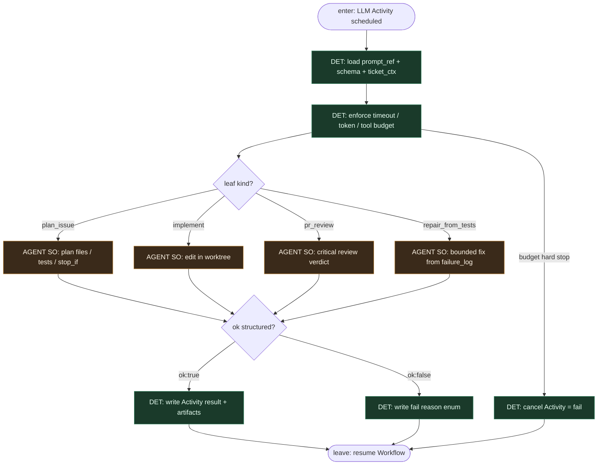

# Subgraph: llm-activity

**Theme:** LLM siedzi **wewnątrz** jednego Activity / `step.run` — wypełnia SO; nie routuje grafu.  
**Mode mix:** AGENT leaf only. Workflow decyduje *kiedy* ten step; Activity decyduje *jak* w budżecie.

## Flow

## Notes

- **Not a router.** Model nie wybiera „co dalej”. Nie woła `StartWorkflow`, nie przestawia label FSM, nie decyduje o merge.
- **One step, one leaf.** Plan / implement / review / repair to osobne Activities (osobne memo). Reviewer ≠ implementer nawet gdy ten sam vendor modelu.
- **Structured output.** `ok:true` + artefakt (plan.json / diff receipt / verdict) albo `ok:false` + reason enum. Brak limbo chat.
- **Activity retry ≠ blind re-prompt.** Temporal/Inngest może ponowić Activity przy crashu infrastruktury; semantyka „napraw testy” to **nowy** step zaplanowany przez Workflow po `run_tests` fail — z `failure_log` w input.
- **Meat ≡ AI.** Ten sam schema seat; kto wypełni SO nie zmienia krawędzi.
- **Handoff contract.** Leave = `{step_id, ok, artifact_ref, reason?, usage}`; Workflow zapisuje w Event History i idzie dalej DET ścieżką.
