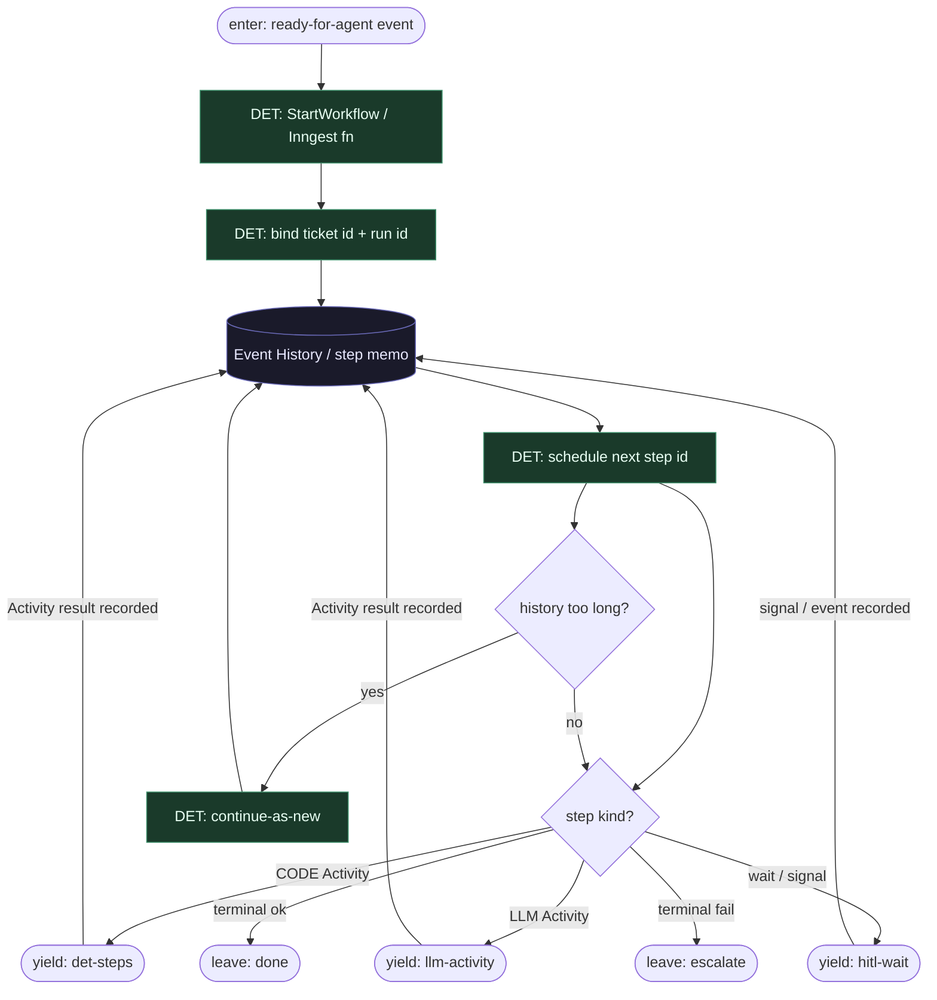

# Subgraph: workflow-spine

**Theme:** Temporal Workflow / Inngest function = deterministyczny szkielet; Event History = źródło prawdy.  
**Mode mix:** DET only. Zero LLM w ciele Workflow.

## Flow

## Notes

- **Replay-safe.** Workflow body czyta tylko historię + wyniki Activities. Żadnych losowych zegarów / LLM / niestabilnych map w ciele (Temporal nondeterminism).
- **Orkiestrator nie myśli.** `schedule next step id` = stała kolejność klepacza (pick → worktree → plan → implement → test → PR → review → merge_policy) + wyniki diamondów budżetu.
- **Durability ≠ agent memory.** Context window modelu nie jest stanem misji. Restart workera = replay Event History.
- **One Workflow per ticket.** K=1 occupancy egzekwowane przed startem lub jako pierwszy DET step; nie fan-out katalogu w środku runu.
- **Handoff contract.** Yield det-steps = `{step_id, activity_name, idempotency_key, input_ref}`; yield llm-activity = `{step_id, prompt_ref, schema, ticket_ctx, attempt}`; yield hitl = `{wait_key, pr_ref, policy}`.
