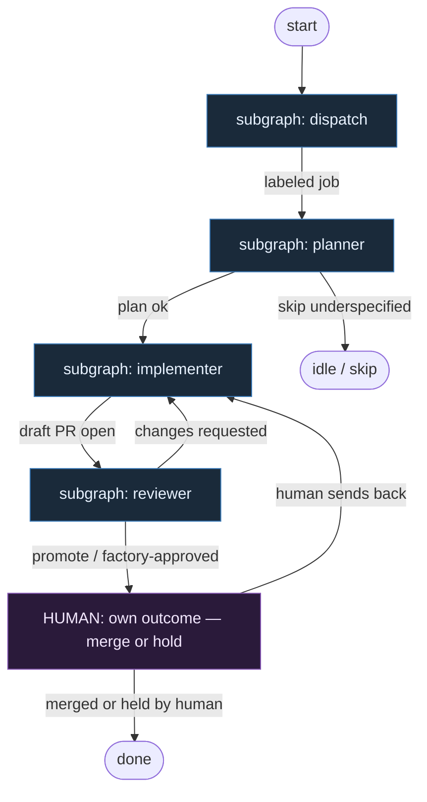

# 16 — Guild Roles

**Persona:** guild-roles compose — fixed specialized seats (Dispatcher → Planner → Implementer → Reviewer); draft PR; humans own the outcome.

**Approach:** compose. Map Guild Software Factory role chain onto klepacz DET/AGENT seats — not one giant coder, not L5 auto-merge.

## Design notes

- **Fixed pipeline, no agent routing.** Order is hard-wired: dispatch → plan → implement → draft PR → review → human outcome. Agents do not choose the next stage.
- **Guild seats, klepacz soul.** Specialized narrow agents (Planner / Implementer / Reviewer) + DET plumbing; meat ≡ AI in AGENT seats without reshaping the graph.
- **Draft PR is the implementer ceiling.** Implementer never merges and never marks ready-to-merge; output is always a **draft** PR (or equivalent factory-draft state).
- **Reviewer ≠ Implementer.** Separate AGENT role: promote draft / request changes / factory-approved signal — never rubber-stamp own diff.
- **Humans own the outcome.** Factory does **not** merge its own PRs. After review promote, merge/close/ship is HUMAN (or explicit MergePolicy Off waiting on human). Agents do the work; people own the result.
- **Planner quality dominates reliability.** Scoping (goal, files, tests, non-goals, stop_if) is first-class AGENT structured output — underspecified → skip cleanly, no limbo theatre.
- **DET owns exhausting middle.** Label/event intake, sandbox prep, branch, commit, push, open draft PR, CI wait — scripts/atoms.
- **Maintenance roles optional, not on critical path.** Conflict Resolver / Janitor / Code Health / Test Triage may sit beside the pipeline; they do not replace Planner→Implementer→Reviewer.
- **One ticket, one draft PR.** K=1; no mega-branches; changes-requested loops back to Implementer with bounded repair.
- **NOT L5.** Closest public productised E-pattern inspiration — still a human merge gate. Polish: ludzie odpowiadają za skutek, agenci za robotę.

## Top-level flowchart

**DET vs AGENT at a glance**

| Seat | Mode | Responsibility |
|------|------|----------------|
| Dispatcher | DET | Events/labels (`guild-auto` / `ready-for-agent`); pick one job; no chat intake |
| Planner | AGENT SO | Issue → implementation plan; scoping quality gate |
| Implementer | AGENT + DET | Sandboxed code; linters/tests; **draft** PR only |
| Reviewer | AGENT SO | Separate role: promote draft / request changes |
| Outcome | HUMAN | Merge, hold, or send back — factory never self-merges |

## Index of subgraphs

| File | Theme | Role in chain |
|------|--------|----------------|
| [subgraph-dispatch.md](./subgraph-dispatch.md) | Label/event → one job | DET Guild Dispatcher |
| [subgraph-planner.md](./subgraph-planner.md) | Issue → plan | AGENT Planner (scoping) |
| [subgraph-implementer.md](./subgraph-implementer.md) | Code → tests → **draft PR** | AGENT Implementer + DET git/PR |
| [subgraph-reviewer.md](./subgraph-reviewer.md) | Critical review → promote | AGENT Reviewer → HUMAN outcome |

## Kryterium sukcesu

Człowiek ma energię na decyzję „merge / hold / odesłać” i na niewygodne pytania — bo nie spalił dnia na plan→klepanie→draft PR. Technicznie: **draft PR z reviewem** na tipie hosta; merge tylko gdy człowiek weźmie odpowiedzialność za skutek.
