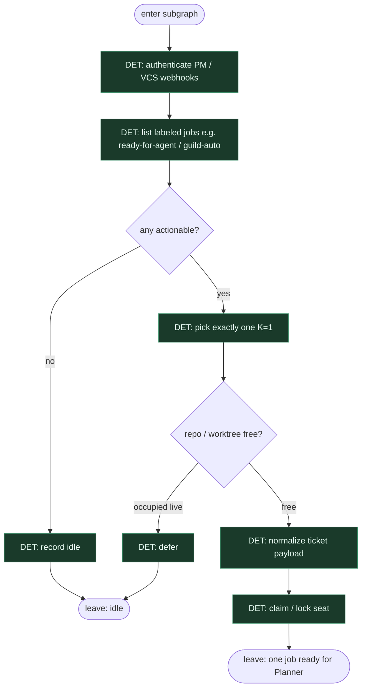

# Subgraph: dispatch

**Theme:** Guild Dispatcher — events/labels → exactly one actionable job.  
**Mode mix:** all DET; no coding agent; no chat intake.

## Flow

## Notes

- **Label = start.** Zero „weź z czatu”; tylko etykieta / event (Guild: `guild-auto`-style).
- **K=1.** Dispatcher never fans out parallel implementers for one mill tick.
- **Fail closed.** Auth or list failure → idle; do not invent work.
- **Handoff contract.** Output = `{ticket, source_event, base_ref}` for Planner.
- **Polish:** dyspozytor to skrypt, nie mózg — kolejka i etykieta, bez routingu agentowego.
