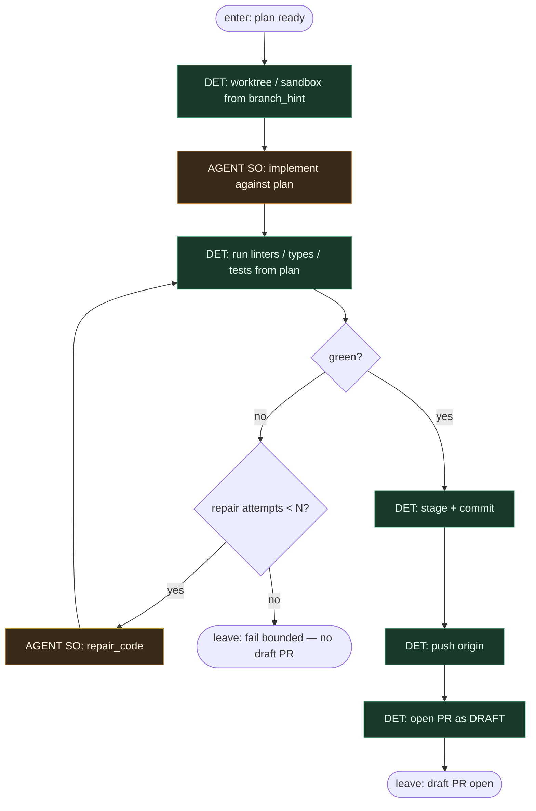

# Subgraph: implementer

**Theme:** Guild Implementer — sandboxed coding + local gates → **draft PR only**.  
**Mode mix:** AGENT for code/repair; DET for sandbox, git, checks, open draft PR.

## Flow

## Invariant: draft ceiling

- PR is created with **draft: true** (or factory-draft label equivalent).
- Implementer **never** merges, never requests human review as “ready” without Reviewer seat, never flips draft→ready.
- Ceiling of this subgraph = `{draft_pr_url, commit_shas, summary}`.

## Notes

- **Sandbox first.** Repo linters/types/tests run before any PR atom.
- **Bounded repair.** Max N repair loops; then fail closed — no infinite self-healing theatre.
- **Meat ≡ AI.** Same AGENT seat for human pair or coding agent; graph unchanged.
- **Plan is contract.** Implementer follows Planner files/non_goals/stop_if; scope creep → ok:false, not silent expansion.
- **Handoff contract.** Output = `{draft_pr, branch, commits, summary}` for Reviewer.
- **Polish:** implementer klepie i otwiera **draft**; merge nie jest jego sprawą.
