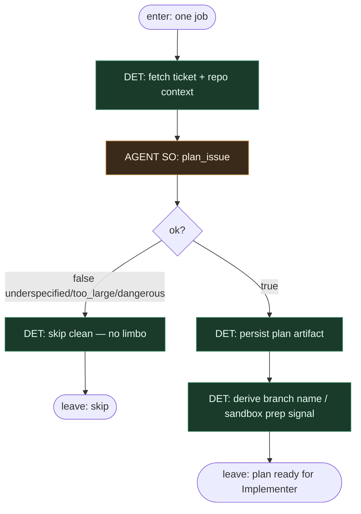

# Subgraph: planner

**Theme:** Guild Planner — issue → implementation plan; scoping quality dominates reliability.  
**Mode mix:** AGENT structured output; DET only for workspace/context fetch.

## Flow



## Structured output (plan_issue)

```json
{
  "ok": true,
  "goal": "...",
  "files": ["..."],
  "test_command": "...",
  "non_goals": ["..."],
  "stop_if": ["auth", "migration"]
}
```

lub `{ "ok": false, "reason": "underspecified"|"too_large"|"dangerous" }` → skip bez limbo.

## Notes

- **Narrow seat.** Planner only plans — does not write product code or open PRs.
- **Scoping is the reliability lever.** Guild lesson: plan quality >> model bravado at implement time.
- **stop_if is sacred.** Auth, migrations, secrets paths → skip or escalate to human; Implementer must not “wing it.”
- **Handoff contract.** Output = `{ticket, plan, branch_hint, test_command}` for Implementer.
- **Polish:** planista rozpisuje pliki/testy/non-goals; nie klepie kodu.
