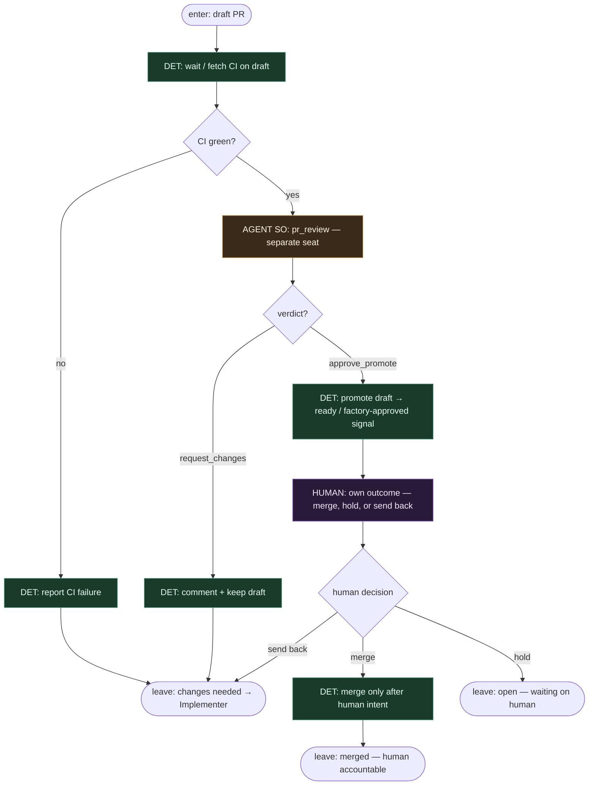

# Subgraph: reviewer

**Theme:** Guild Reviewer — separate agent reviews draft; promote or request changes; **HUMAN owns outcome**.  
**Mode mix:** DET for CI; AGENT SO for critical review; HUMAN for merge/hold.

## Flow



## Structured output (pr_review)

```json
{
  "ok": true,
  "verdict": "approve_promote"|"request_changes",
  "reasons": ["..."],
  "qa_questions": ["czemu tak — nie da się prościej?"],
  "architecture_fit": "ok"|"risk"|"blocks"
}
```

## Notes

- **Separate role.** Reviewer never wrote the diff (Guild + godark pattern: reviewer without write to product paths in this seat).
- **Promote ≠ merge.** `approve_promote` only lifts draft / stamps factory-approved; **merge requires HUMAN**.
- **Humans own the outcome.** Explicit Guild rule in klepacz form: factory does not merge its own PRs; people own ship/hold.
- **QA strategy stays.** Uncomfortable questions are first-class in `qa_questions` — energy preserved for humans after agents did the klepanie.
- **Changes-requested loops to Implementer** at top level with feedback payload; bounded pr_repair may apply upstream.
- **Handoff contract.** Output = `{promoted: bool, verdict, reasons}` then HUMAN `{merged|held|sent_back}`.
- **Polish:** recenzent promuje draft; człowiek odpowiada za merge i skutek.
