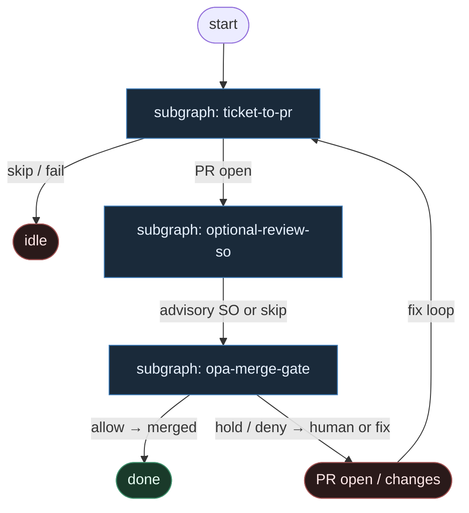

# 17 — OPA Merge Gate

**Persona:** policy-as-code cynic — Rego/Conftest trzyma przycisk merge; „LLM judge” to opcjonalny hałas, nigdy wyrok.

**Approach:** from_scratch. Osobny graf + podgrafy tematyczne (nie monolit). Polish OK.

## Design notes

- **Merge verdict = pure DET.** OPA / Conftest / Rego (lub równoważny policy-as-code) decyduje `allow | deny | hold`. Exit code i JSON decyzji — nie prompt, nie „LGTM” od modelu.
- **Optional review SO ≠ merge.** AGENT structured review może dodać `risk`, `reasons[]`, komentarze — to **wejście** do paczki policy, nie autoryzacja merge. Model nie klika merge. Nigdy.
- **Cynizm wobec LLM judges.** Model, który wczoraj approve’ował drop tabeli, jutro napisze poemat o bezpieczeństwie. Rego nie halucynuje. Conftest nie „czuje vibe’u PR”.
- **Fail-closed.** Brak inputu do policy, czerwone CI, chronione ścieżki, za duży diff, brak required checks → `deny`/`hold`. Zero „agent override policy”.
- **DET łańcuch do PR.** Pick labeled → implement (AGENT SO) → test → commit/push → open PR. Klepacz kończy na otwartym PR; merge jest osobną bramką DET.
- **Off / Classify / Always = gałka w Rego.** Nie osobny „LLM classifier”. Classify = reguły na size/paths/labels/CI; Always = wąski allowlist; Off = zawsze hold dla człowieka.
- **Meat ≡ AI w implement/review.** To samo siedzenie AGENT; graf nie rozróżnia. Merge seat jest **tylko** skrypt + OPA.
- **NOT L5.** Cel: zdjąć klepanie merge z człowieka *gdy polityka jest zielona* — nie lights-out bank, nie „wyrzuć inżyniera”.
- **Jedna ticket → jeden PR.** Paczka OPA jest per-PR; bez batch theatre.
- **Kryterium:** zmergowany `ai/fix` na tipie hosta gdy policy mówi allow — albo świadomy hold. Nie ładny JSON od „sędziego” LLM bez skutku.

## Top-level flowchart

**DET vs AGENT at a glance**

| Layer | Mode | Merge authority? | Why |
|-------|------|------------------|-----|
| Pick labeled / branch | DET | no | bez tego nie ma pracy |
| Implement | AGENT SO | no | jedyna entropia kodu |
| Test / commit / push / open PR | DET | no | plumbing |
| Optional critical review | AGENT SO (optional) | **never** | advisory risk/reasons only |
| OPA input pack | DET | no | fakty: CI, paths, size, labels, SO fields |
| Conftest / `opa eval` | **DET** | **yes — sole verdict** | policy-as-code |
| `gh pr merge` / hold | DET | executes verdict | skrypt po allow; inaczej stop |

## Index of subgraphs

| File | Theme | Role in chain |
|------|--------|----------------|
| [subgraph-ticket-to-pr.md](./subgraph-ticket-to-pr.md) | labeled issue → implement → PR | DET spine + AGENT implement; zero merge |
| [subgraph-optional-review-so.md](./subgraph-optional-review-so.md) | optional AGENT SO review | advisory only; never merge button |
| [subgraph-opa-merge-gate.md](./subgraph-opa-merge-gate.md) | pack → OPA/Conftest → merge/hold | **pure DET verdict** |

## Antyteza (czego tu nie ma)

- LLM „MergePolicy Classify” jako prompt
- Rubber-stamp bot bez Rego
- Reviewer AGENT z uprawnieniem `merge`
- Agent override czerwonego CI „bo model pewny”
- Jednolity fat graf z merge w środku implementera
