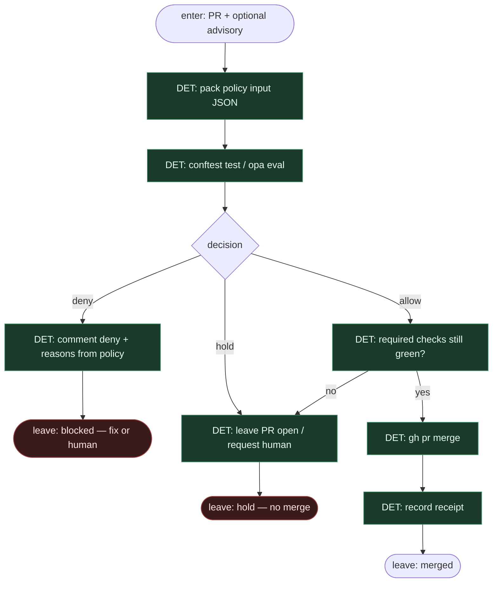

# Subgraph: opa-merge-gate

**Theme:** złóż fakty → OPA/Conftest → `allow|deny|hold` → merge skryptem albo stop.  
**Mode mix:** **100% DET.** Tu nie ma LLM. Tu kończy się wiara w „LLM judge”.

## Flow



## Policy input pack (DET — przykładowe pola)

```json
{
  "pr": {"number": 0, "additions": 0, "deletions": 0, "files": ["..."]},
  "ci": {"green": true, "checks": ["..."]},
  "paths": {"protected_hit": false, "allowed_globs_ok": true},
  "labels": ["ready-for-agent", "auto-merge-candidate"],
  "advisory": {"present": false, "risk": null, "verdict": null},
  "policy_knob": "off|classify|always"
}
```

## Rego / Conftest (szkic intencji — nie runtime)

- `deny` jeśli `ci.green == false`
- `deny` jeśli `paths.protected_hit` (auth, billing, migrations, …)
- `hold` jeśli `policy_knob == "off"`
- `hold` jeśli `policy_knob == "classify"` i (size ponad próg **lub** `advisory.risk == "high"` **lub** brak advisory gdy policy wymaga)
- `allow` tylko gdy knob + reguły ścieżek/size/CI się zgadzają
- **Zakaz:** reguła typu `allow if advisory.verdict == "approve"` jako *jedyny* warunek — approve LLM jest najwyżej sygnałem pomocniczym, nie wyrokiem

## Notes

- **Sole merge authority.** Tylko ten podgraf może wywołać merge — i tylko po `allow` z OPA/Conftest.
- **Conftest exit code > tysiąc tokenów LGTM.** Polityka wersjonowana w repo (`policy/*.rego`), reviewowalna jak kod.
- **Advisory jest daną, nie sędzią.** Jeśli SO mówi `reject` / `high`, Rego *może* mapować to na hold — ale odwrotnie: samotne `approve` nigdy nie omija chronionych ścieżek ani czerwonego CI.
- **Always jest wąski.** Docs/lockfile/bugfix z testem — allowlist w policy, nie „model pewny na 0.9”.
- **Human path first-class.** `hold` / `deny` zostawia PR; człowiek merguje albo wraca fix loop do ticket-to-pr.
- **Handoff:** `{merged:true, sha, decision}` | `{merged:false, decision, policy_reasons[]}`.
