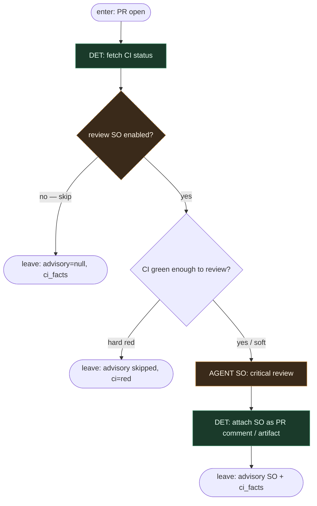

# Subgraph: optional-review-so

**Theme:** opcjonalny krytyczny review AGENT SO — **doradczy**.  
**Mode mix:** AGENT SO + DET wait CI. **Zakaz:** ten podgraf nie merguje i nie wystawia `allow`.

## Flow



## Structured output (kontrakt)

```json
{
  "verdict": "approve|changes|reject",
  "reasons": ["..."],
  "risk": "low|medium|high",
  "questions": ["niewygodne pytanie QA..."]
}
```

## Notes

- **Cynical axiom.** `verdict: approve` od LLM **nie** otwiera merge. To pole w JSON dla OPA — jeśli policy w ogóle je czyta.
- **Optional.** Gałka off = zero tokenów na „sędziego”. Policy i tak może wymagać człowieka (hold).
- **Osobna rola.** Nie ten sam seat co implement (meat lub AI).
- **reasons[] = QA strategy.** Niewygodne pytania tu, nie osobny teatr „strategia AGENT”.
- **CI red:** nie proś modelu o override. Zostaw fakty; OPA i tak fail-closed.
- **Handoff:** `{advisory: SO|null, ci_status, checks[]}` → opa-merge-gate. Żadnego `merge=true` z tego węzła.
