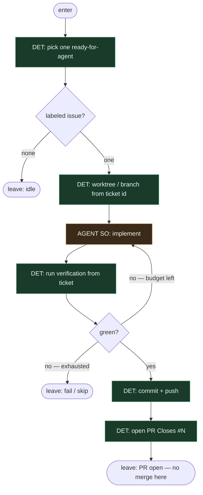

# Subgraph: ticket-to-pr

**Theme:** labeled ticket → implement → local test → commit/push → open PR.  
**Mode mix:** DET spine; AGENT SO tylko na implement. **Zero merge.**

## Flow

## Notes

- **Coder ≠ merge.** Ten podgraf kończy na otwartym PR. Przycisk merge żyje dopiero w OPA gate.
- **Label = start.** Zero „weź z czatu”. Brak etykiety → idle.
- **Implement = AGENT SO.** `{ok, summary, files_touched}` albo `{ok:false, reason}` → skip bez limbo theatre.
- **Bounded local repair.** Czerwony test → ograniczona pętla w tym samym liściu; potem fail. Bez zagnieżdżonego SDLC.
- **DET git/PR.** Nazwa brancha, commit message z ticket id, `gh pr create` — skrypt.
- **Handoff:** `{pr, head_sha, base, ticket_id, files_touched}` → optional review / OPA pack.
