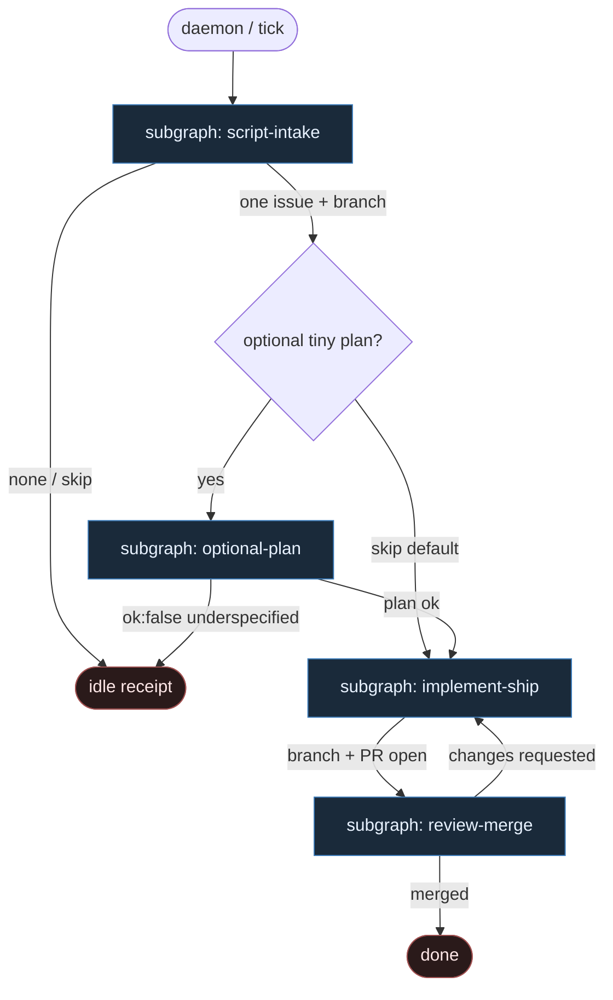

# 18 — Script intake

**Persona:** script-first pragmatic — intake = czyste skrypty; agent **nigdy** nie wybiera pracy; opcjonalny maleńki plan dopiero **po** picku.

**Approach:** from_scratch. Jeden graf, osobne podgrafy tematyczne. Zero „agent pickuje z czatu”.

## Design notes

- **Intake = 100% DET.** `list issues` → `filter labeled` → `pick one (K=1)`. Żaden AGENT, żaden LLM, żadne „co dziś robimy?”.
- **Agent never chooses work.** Etykieta (`ready-for-agent` / równoważna) + skrypt picku decydują. Chat nie jest front door.
- **Opcjonalny tiny plan AFTER pick.** Dopiero gdy issue jest już wybrane, może wejść wąski AGENT SO (goal / files / stop_if). Domyślnie skip — ticket jasny → prosto do implement.
- **Script-first pragmatic.** Preferujemy skrypt nad ceremonią. Auth, lista, filtr, pick, branch, commit, push, open PR, CI, merge — DET. Entropia tylko w liściach: opcjonalny plan, implement, critical review.
- **K=1 / one ticket one PR.** Pick zwraca zero albo jeden. Brak batcha, brak katalogu równoległego.
- **Fail closed.** Brak labeled → idle. Underspecified bez acceptance → skip (nie invent work). DET fail ≠ „niech agent coś wymyśli”.
- **Meat ≡ AI.** To samo siedzenie AGENT; graf się nie zmienia.
- **NOT L5.** Zdejmujemy wyczerpujące klepanie intake→PR. Człowiek zostaje przy architekturze, trudnych decyzjach i QA-strategii.
- **Cel (SOUL):** człowiek ma energię na myślenie — bo skrypt już wziął następny labeled ticket.

## Top-level flowchart

**DET vs AGENT at a glance**

| Warstwa | Mode | Odpowiedzialność |
|---------|------|------------------|
| List / filter labeled / pick K=1 | DET | jedyny front door — agent nie wybiera |
| Branch / worktree | DET | z ID ticketa |
| Tiny plan (opcjonalny) | AGENT SO | tylko **po** picku; wąski schema |
| Implement | AGENT | kod / diff |
| Commit / push / open PR / CI | DET | plumbing |
| Critical review | AGENT | osobna rola + niewygodne pytania |
| Merge | DET | po approve + green |

## Index of subgraphs

| File | Theme | Role in chain |
|------|--------|----------------|
| [subgraph-script-intake.md](./subgraph-script-intake.md) | list → filter labeled → pick one | **pure scripts**; agent never chooses |
| [subgraph-optional-plan.md](./subgraph-optional-plan.md) | tiny plan SO | opcjonalny, **po** picku |
| [subgraph-implement-ship.md](./subgraph-implement-ship.md) | implement → commit → push → PR | AGENT code + DET git/PR |
| [subgraph-review-merge.md](./subgraph-review-merge.md) | critical review → merge | AGENT review + DET merge |

## Invariants

1. Intake nigdy nie woła LLM.
2. Pick = skrypt (stable order), nie preferencja agenta.
3. Plan leaf nie istnieje przed pickiem i nie może zmienić wybranego issue.
4. Brak labeled → idle, nie „znajdź coś podobnego”.
5. Coder ceiling = open PR; merge / review = osobne.
