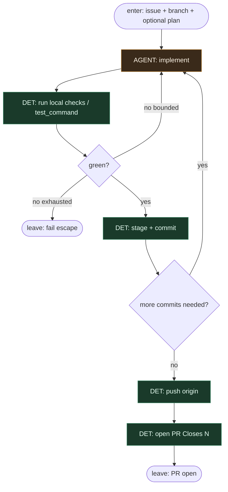

# Subgraph: implement-ship

**Theme:** implement → local checks → commit(s) → push → open PR.  
**Mode mix:** AGENT implement; DET git/PR plumbing.  
**Ceiling:** open PR (`Closes #N`). Merge żyje w review-merge.

## Flow

## Notes

- **Implement = jedyny entropy sink kodu.** Plan (jeśli był) jest inputem, nie drugim mózgiem orkiestrującym tool-calling.
- **Bounded repair.** Lokalny fail → wróć do implement z limitem; po wyczerpaniu fail escape + receipt — nie nieskończona pętla.
- **Commits DET.** Message z ticket id + krótkie summary; bez release-note powieści.
- **One PR.** `Closes #<issue>` — K=1 zachowane do końca.
- **Nie pickujemy tu.** Ten podgraf nie listuje issues i nie zmienia labeli startowych.
- **Handoff:** `{pr_url, branch, commit_shas, summary}` → review-merge.
