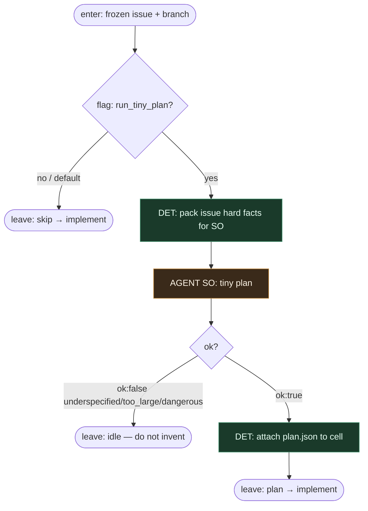

# Subgraph: optional-plan

**Theme:** maleńki AGENT plan **dopiero po** script picku.  
**Mode mix:** jeden wąski liść SO; wejście/wyjście DET.  
**Default:** **skip** — ticket jasny → prosto do implement-ship.

## Flow



## Tiny plan SO contract

**ok:true**

```json
{
  "ok": true,
  "goal": "…",
  "files": ["…"],
  "test_command": "…",
  "non_goals": ["…"],
  "stop_if": ["…"]
}
```

**ok:false** — enum `reason`: `underspecified` | `too_large` | `dangerous`

Plan **nie** może:

- zmienić wybranego `issue_id`
- dodać drugiego ticketa
- otworzyć nowego picku / listy issues
- routować następnego węzła grafu

## Notes

- **After pick only.** Wywołanie przed script-intake jest niedozwolone — złamałoby invariant „agent never chooses work”.
- **Optional = skip by default.** Script-first pragmatic: nie planujemy dla sportu.
- **Tiny.** Goal + files + stop_if. Nie epic breakdown, nie multi-PR roadmap.
- **Fail → idle, nie enrich.** `underspecified` kończy przebieg; człowiek poprawia issue / label. Plan leaf nie dopisuje acceptance.
- **Meat ≡ AI.** Ten sam schema liść — człowiek-planista albo model.
- **Handoff:** `{issue, branch, plan?}` — `plan` optional field.
