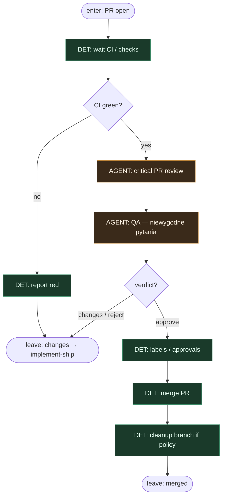

# Subgraph: review-merge

**Theme:** CI → critical review (osobna rola) → merge DET.  
**Mode mix:** AGENT review + QA strategy; DET checks / merge.

## Flow

## Notes

- **Osobna rola.** Reviewer ≠ implementer (meat lub AI — to samo siedzenie, inna osoba/instancja).
- **QA strategy stays.** Scope creep, brak testów, rollback, „czemu nie prościej?” — first-class, nie fluff.
- **CI = DET gate.** AGENT nie overridenuje czerwonego builda na thin path.
- **Merge = skrypt.** Po approve + green → merge. Konflikt / policy block → człowiek.
- **Changes loop** wraca do implement-ship na top-level — bez re-pick (issue zamrożone z script-intake).
- **Handoff:** `{merged:true, merge_sha}` albo `{merged:false, feedback}`.
