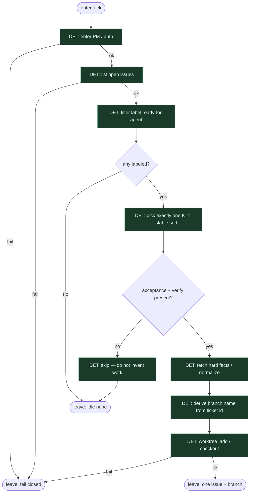

# Subgraph: script-intake

**Theme:** list issues → filter labeled → pick exactly one.  
**Mode mix:** **100% DET.** Zero AGENT. Agent never chooses work.  
**Handoff out:** `{ok:true, issue, label, branch, base_ref}` albo `{ok:false, reason:none|skip|auth|api}`.

## Flow

## Script atoms (ok|fail)

| Atom | Idea | ok means | fail / idle |
|------|------|----------|-------------|
| `pm_auth` | token / CLI context | sesja żywa | `auth` |
| `list_open_issues` | `gh issue list --state open --json …` | JSON lista | `api` |
| `filter_labeled` | keep only `ready-for-agent` (lub kanoniczna etykieta) | podlista | — (pusta = idle) |
| `pick_one_k1` | stabilny sort (np. number ASC) → head 1 | dokładnie 0\|1 | `none` gdy 0 |
| `assert_acceptance` | body ma acceptance + verify | ticket actionable | `skip` — nie enrich |
| `normalize_facts` | id, title, body, labels | payload stabilny | `api` / `closed` |
| `branch_name` | `ai/<id>-<slug>` | deterministyczna nazwa | — |
| `worktree_add` | fresh cell z base tip | ścieżka worktree | `occupancy` / `git` |

## Notes

- **Pure scripts.** Ten podgraf nie ma liścia LLM i nie może go dostać „na skróty”.
- **Label = start.** Bez etykiety nie ma pracy. Chat / preferencja modelu nie jest intake.
- **K=1.** `pick_one_k1` nigdy nie zwraca tablicy do równoległego siewu.
- **Stable pick.** Sort deterministyczny — ten sam pool → ten sam pick. Agent nie „wybiera ciekawszy”.
- **`none` ≠ awaria.** Legalny terminal → idle receipt.
- **Underspecified = skip.** Brak acceptance/verify → wyjście. Nie wołamy plan leafa, żeby „dopisał” brakujące.
- **Handoff contract.** Dopiero stąd wolno wejść w optional-plan albo implement-ship. Issue id jest **zamrożone**.
