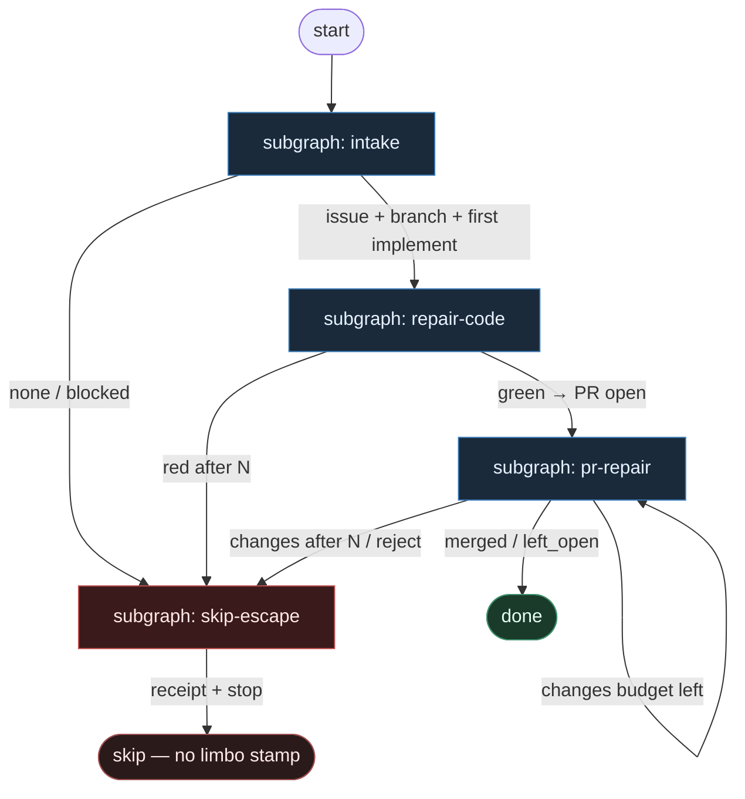

# 19 — Bounded Repair

**Persona:** bounded-escape pessimistic — zakładaj czerwone testy i `changes` z review; daj **twarde N** na `repair_code` i `pr_repair`; po wyczerpaniu **skip z receipt**, nigdy limbo stamp.

**Approach:** from_scratch. Osobny graf + tematyczne podgrafy (nie monolit). Polish OK.

## Design notes

- **Dwa bounded loop'y, nic więcej.** (1) lokalny test czerwony → `repair_code` ≤ N. (2) review `changes` → `pr_repair` ≤ N. Po budget = **skip/escape**, nie „jeszcze raz z innym modelem”.
- **Pessimista z wyjściem.** Zakładaj flake, czerwony lokalny, review z `changes`, stuck PR. Ale escape jest **first-class**: jawny skip + receipt JSON. Zero `ai:deferred` / `needs-human-maybe` / limbo theatre.
- **Licznik DET, nie vibe.** Budżet N żyje w stanie grafu (`repair_code_used`, `pr_repair_used`). Agent nie resetuje licznika i nie „prosi o jeszcze jedną szansę”.
- **AGENT SO tylko w cienkich liściach.** `implement` / `repair_code` / `pr_repair` / `critical_review`. Git, test runner, open PR, merge policy, skip receipt = DET.
- **Skip ≠ porażka wstydliwa.** Skip po N to legalny terminal: ticket zostaje (label ready opcjonalnie zdejmowany), receipt na issue/PR, człowiek decyduje dalej. Nie stamp limbo.
- **Meat ≡ AI.** To samo siedzenie AGENT; graf nie rozróżnia.
- **NOT L5.** Cel z SOUL: zdjąć wyczerpujące klepanie (retry w nieskończoność). Człowiek zostaje przy architekturze i trudnych decyzjach po skip.
- **Jeden ticket, jeden PR.** K=1. `pr_repair` poprawia ten sam branch/PR — nie otwiera drugiego.
- **Kryterium:** zmergowany lub świadomie `left_open` / `skipped` `ai/fix` z receipt — nigdy etykieta limbo i nigdy nieskończony repair.

## Top-level flowchart

**DET vs AGENT at a glance**

| Layer | Mode | Responsibility |
|-------|------|----------------|
| Intake pick + worktree | DET | labeled issue, K=1, branch |
| First implement | AGENT SO | coding judgment |
| Local test gate | DET | `test_command`; green/red oracle |
| `repair_code` ≤ N | AGENT SO + DET counter | fix lokalny; N wyczerpane → skip |
| Commit / push / open PR | DET | tylko po green |
| Critical review | AGENT SO | osobna rola; verdict + reasons[] |
| `pr_repair` ≤ N | AGENT SO + DET counter | push fix na ten sam PR; N → skip |
| Merge policy | DET | Off \| Classify \| Always — never LLM merge |
| Skip / escape | DET | receipt, optional HITL ping — **no limbo label** |

## Index of subgraphs

| File | Theme | Role in chain |
|------|--------|----------------|
| [subgraph-intake.md](./subgraph-intake.md) | pick → worktree → first implement | DET front door + pierwszy AGENT code |
| [subgraph-repair-code.md](./subgraph-repair-code.md) | test red → `repair_code` max N | lokalny bounded repair loop |
| [subgraph-pr-repair.md](./subgraph-pr-repair.md) | review `changes` → `pr_repair` max N | PR-level bounded repair + merge policy |
| [subgraph-skip-escape.md](./subgraph-skip-escape.md) | budget exhausted → skip receipt | escape bez limbo stamps |

## Budgets (defaults)

| Counter | Default N | Trigger | Exhausted exit |
|---------|-----------|---------|----------------|
| `repair_code_used` | **2** | lokalny test red po implement / poprzednim repair | skip `local_test_red_exhausted` |
| `pr_repair_used` | **2** | review verdict `changes` | skip `pr_repair_exhausted` (PR left open) |

N jest gałką w MANIFEST — nie promptem. Pessimista woli małe N i czysty skip niż „naprawiaj aż przejdzie”.

## Antyteza (czego tu nie ma)

- Nieskończony local repair / nested SDLC w liściu
- Limbo labels (`ai:deferred`, `needs-human-maybe`, `workflow:limbo`)
- Agent resetujący budżet albo „proszący o jeszcze jedną próbę”
- Osobny fat orchestrator ReAct wybierający „czy warto naprawiać”
- Multi-PR na jeden ticket przy `pr_repair`
- L5 lights-out / „wyrzuć człowieka po skip”

## Kryterium sukcesu

Człowiek ma energię na architekturę i niewygodne pytania — bo DET uciął nieskończone retry. Technicznie: albo zielony lokalny → PR → (merge \| left_open), albo **świadomy skip z receipt** po N — nigdy limbo stamp, nigdy ciche `outcome=none`.
